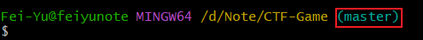
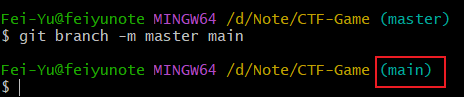
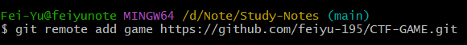
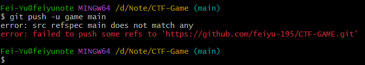
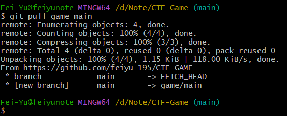
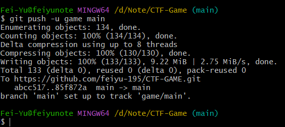

# git使用

### 添加上传

将全部内容添加，先输入以下指令：

```powershell
git add .
```

如果是指定目录，就改为以下指令：

```powershell
git add 目录
```

如果是指定文件，就改为以下指令：

```powershell
git add 文件.后缀
```

之后，再输入以下指令：

```powershell
 git commit -m "注释[会显示在github上的备注栏]"
```

到这里，可以看到如下页面：



这个时候当我们上传到github main分支发现会报错，因为git bash默认帮我们创建的是master分支，这是我们只能上传到一个新分支master（github以前的默认主分支），我们可以通过修改git默认分支名称来更改：

```powershell
git branch m master main
```



这是我们就可以通过push命令上传到github仓库：

先绑定github仓库：



到这里，你的添加并没有上传到仓库，只是添加到了暂存区，上传到仓库还需要输入以下指令：

```powershell
 git push -u [remote绑定的名称("game")] main
```

最后，还会有个提示，输入 yes 即可。


*注：*

在上传main分支是，还可能有个报错，



这是因为在创建git仓库是，勾选了默认创建一个README文件，导致git远程仓库有该文件，但是我们的本地仓库没有该文件，所以我们可以先合并文件到本地仓库，在通过push上传：



在通过push上传到github远程仓库，可以看到上传成功：



在github中查看也可以看到文件。