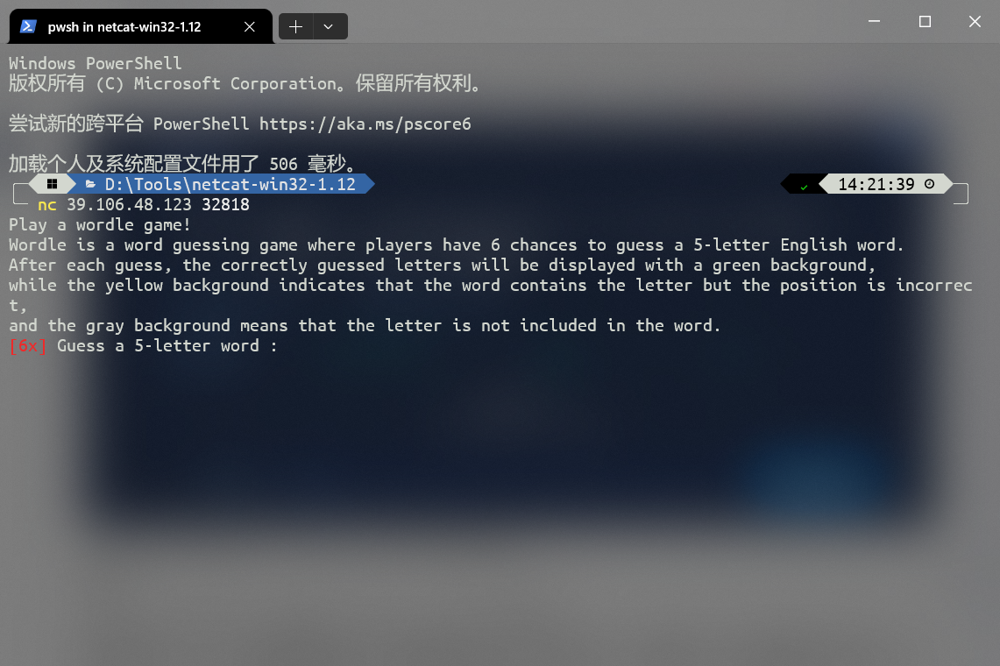

## 题目描述

做题累了,不如跟小楠楠起来玩个wordle游戏， 边玩边学英文，一举两得。
(纯游戏,通关即拿flag)

Wordle游戏（纯纯玩游戏，通关就给flag）

## 解题

nc命令可以在kali中直接使用，若想在windows中使用需下载netcat

连接后



翻译：Worldle是一款猜谜游戏，玩家有6次机会猜出一个5个字母的英语单词。

每次猜对后，猜对的字母将以绿色背景显示，黄色背景表示单词中包含该字母，但位置错误，灰色背景表示该字母不包含在单词中。（6次机会后游戏将重来，最终的单词也会改变[天知道我试了几遍]）

技巧：仅供参考

```markdown
slung        watch        bedim        proxy
chief        balmy        swung        dropt
grown        pylas        bedim        kutch
unfix        embow        stack        glyph
fakir        compt        vends        bulgy
depth        smirk        bacon        gulfy
divot        whack        flung        sperm
furzy        blive        swamp        noght
farce        width        glump        bosky
perch        unbox        swift        glazy
hexad        truck        filmy        spong
can't        hiems        budgy        flowk
whist        pored        mucky        flang
quern        sixth        clomp        gawky
skied        foxly        whang        crumb
glode        barky        chump        snift
pyxle        round        might        backs
gloam        twink        fuchs        predy
spied        brawn        foxly        kutch
shrub        aztec        flowk        dying
ruble        potch        mawks        dying
modal        quegh        swink        crypt
sprew        batch        dungy        jolif
fishy        zante        drock        plumb
shrag        oxfly        unbid        kempt
chips        flunk        grove        bawdy
grise        han't        flock        dumpy
chirk        bawdy        spent        mogul
shuck        bigot        predy        flawn
lobed        stump        finch        jarvy
tewan        pilch        fjord        busky
dwelt        bunch        favor        skimp
emyds        virtu        bhang        flock
plant        shock        refix        budgy
thumb        eland        grovy        spick
siker        bawdy        potch        flung
segno        thump        dicky        brawl
braky        medoc        whisp        flung
dansk        trump        elbow        chivy
amzel        whist        frock        pudgy
those        bulky        dwang        crimp
sider        potch        flung        mawky
cetin        ampyx        shrug        flowk
batch        mured        gipsy        flown
```


成功后将会直接给我们flag（这波运气绝了）

flag{805f21f3-1e9d-44e4-9a82-b9975480816d}


