## 题目描述

小楠楠明明看到了flag，怎么打开文件却找不到呢?

## 解题

分析题目叫开心的取证，猜测与取证相关，下载附件，发现是一个流量包：

打开提取Http对象查看是否有文件：

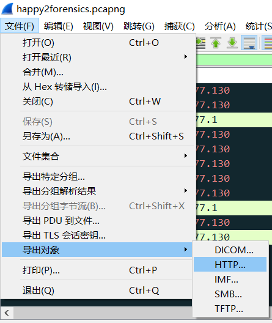

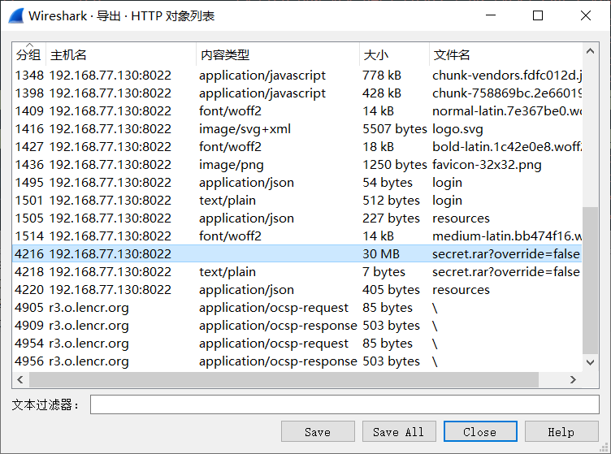

可以看到里面有一个非常大的数据包(secret.rar)，猜测是一个压缩包，点击保存为rar包，解压发现是一个磁盘镜像，但是有BitLocker加密；

猜测密码也在流量包中，

检索http流量包，没有发现；

检索tcp的80端口，可以看到有很多其他的随机端口，没有规律，但是仔细查看发现有一个20端口的流量，于是进一步检索tcp的20端口和80端口：

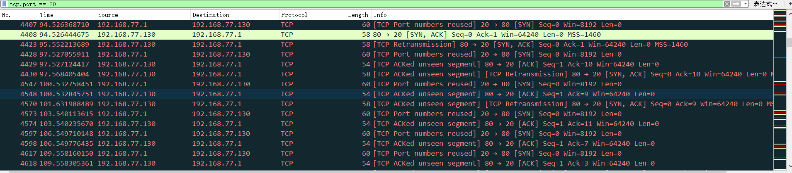

可以看到有很多20到80端口的数据交互，因为80到20端口的数据包为ack报文，所以我直接检索`tcp.srcport==20 && tcp.dstport==80`

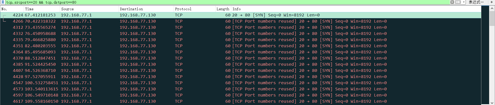

可以看到有很多几乎相同的数据包，仔细查看每个数据包，发现在每个数据包的一个位置发现BitLocker关键字，将每个数据包的该位置记录下来，得到了BitLocker的密钥：

`b`

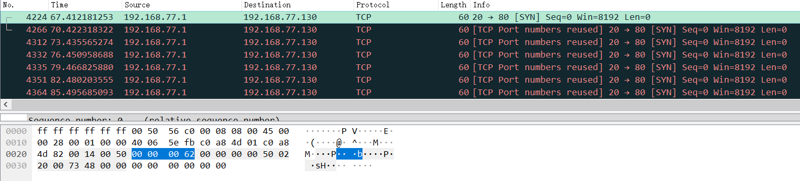

`i`

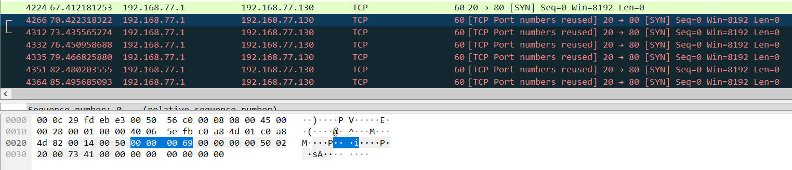

`t`

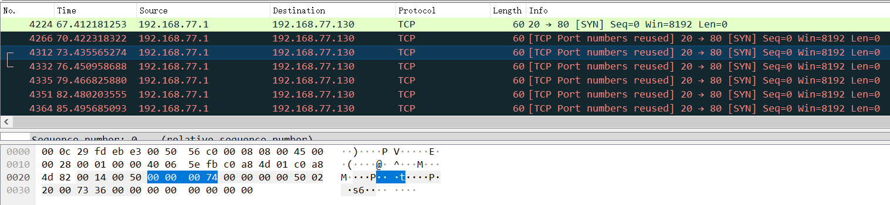

`l`

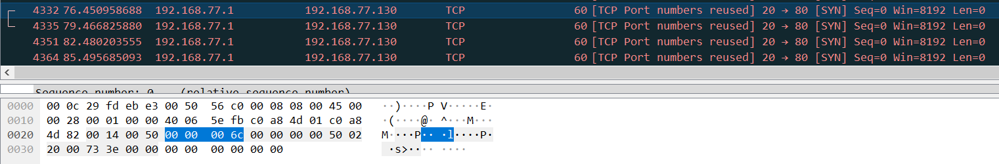

---

注意规律都是`6`位一组：`bitlocker:120483-350966-299189-055297-225478-133463-431684-359403`

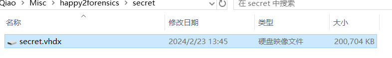

双击镜像装载，然后再资源管理器双击后，点击输入恢复密钥：

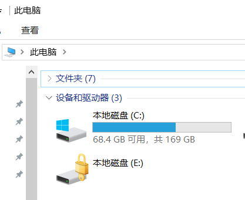

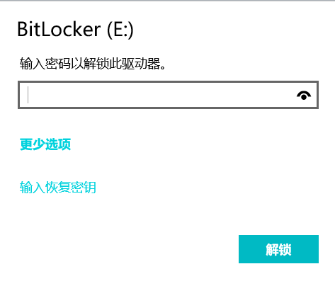

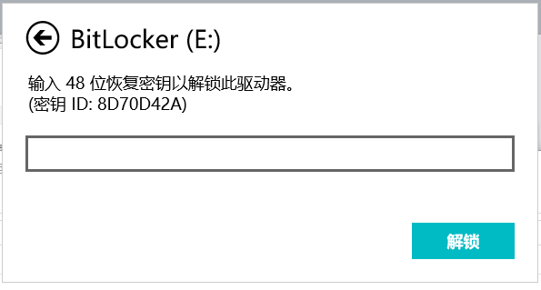

解锁后发现镜像中有很多相同的图片和一个`Tips:压缩包真的有密码，无需尝试伪加密、弱口令等。`；

仔细查看图片发现有一个图片大小明显不对，并且也打不开。。。

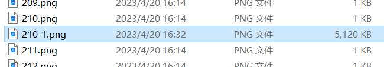

但我们先不管其他，因为已知这道题与取证有关，

所以我们直接把解锁的驱动器整个作为证据放入`AXIOM Process`进行取证：

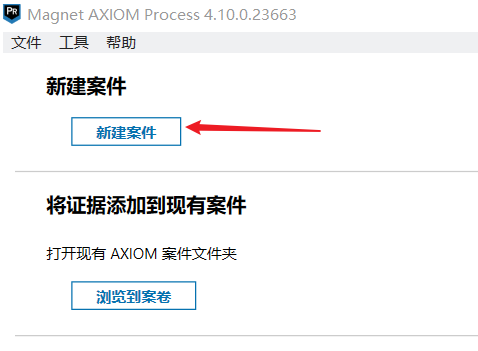

点击证据来源，选择windows里的驱动器，选择题目解锁的驱动器：

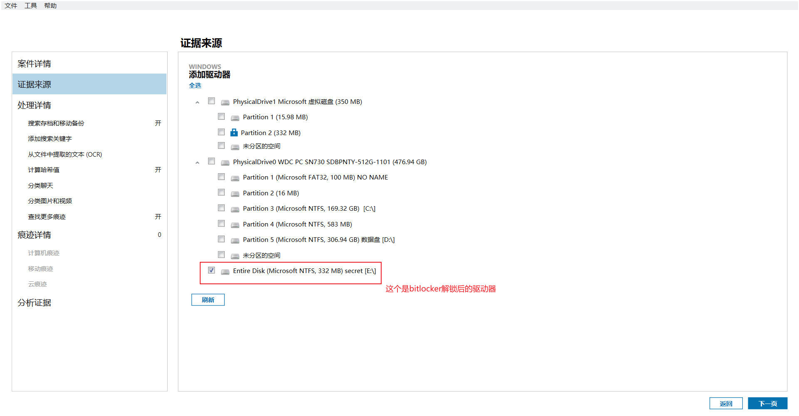

可以一直惦记下一步知道开始分析证据，会打开`AXIOM Examine`：

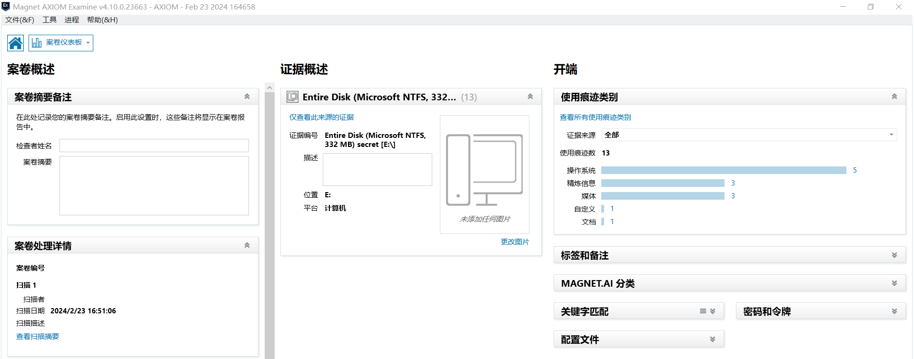

点击案件仪表盘中的使用痕迹可以看到取得的信息：

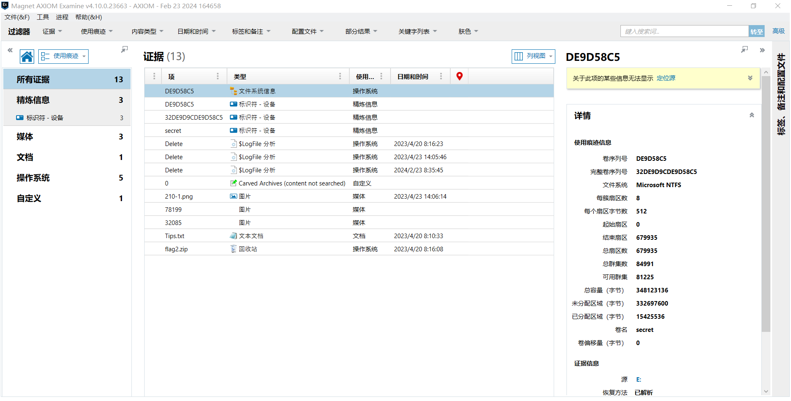

上图中左边一栏的痕迹分类，中间一栏是使用的痕迹文件等信息，右边一栏可以看到文件的预览信息和痕迹来源：

通过查看证据可以知道，有两张图片的来源都是图`210-1.png`：

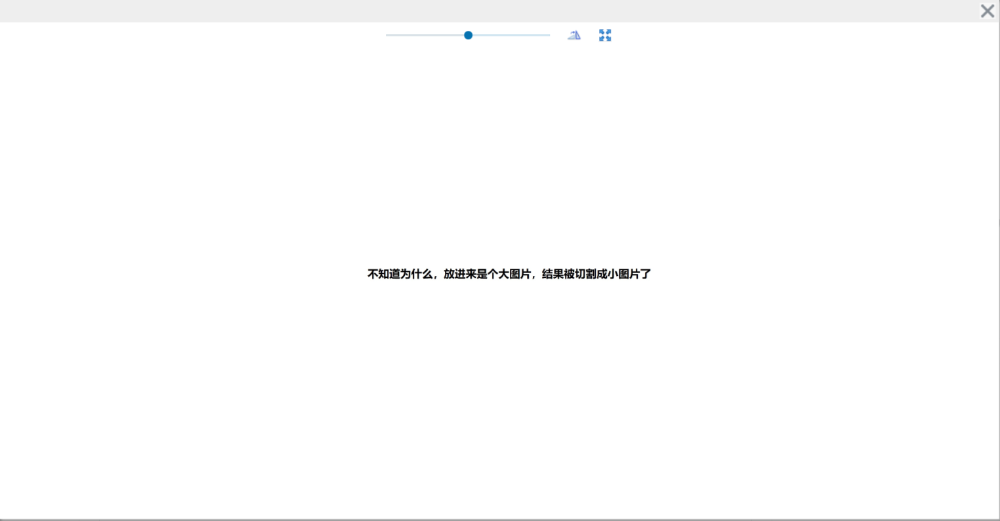

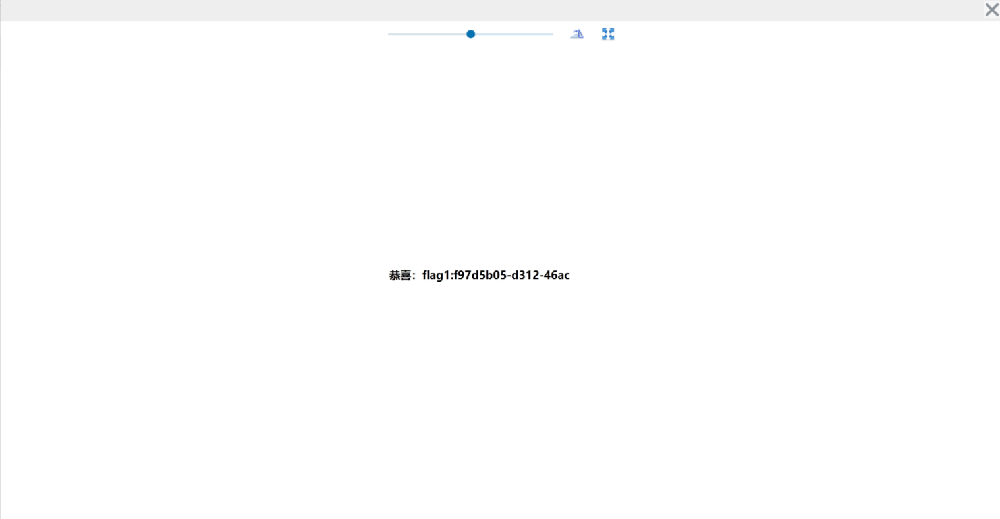

可以看到出现了`flag1:f97d5b05-d312-46ac`

还有一个`flag.zip`文件来源于磁盘的$RECYCLE.BIN文件夹下`E:\$RECYCLE.BIN\S-1-5-21-593056737-2904054994-1051541182-1001\$I6BSXIA.zip`

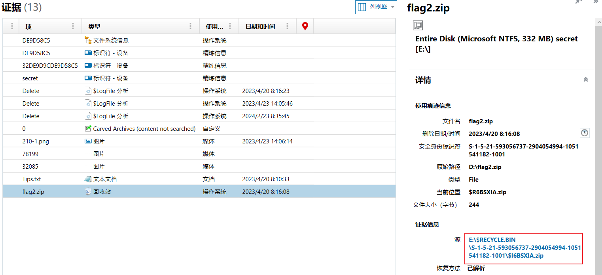

这个文件夹是每个磁盘都有的，是属于磁盘的回收站，也就是说出题者将flag.zip删除了放入了回收站，但是我们通过取证得知该文件还在驱动器的回收站中，还能使用数据恢复软件恢复，

> [DiskGenius – 正式版下载|免费下载](https://www.diskgenius.cn/download.php)

根据之前的驱动器文件的查看可以知道`flag.zip`这一文件应该就是那个拥有密码的文件了，但是还不知道密码

继续分析，通过之前的取证分析，图片`210-1.png`下有两个图片，但是光这两个图片显然没有50M内存猜测还有其他文件，

尝试直接将图片`210-1.png`修改后缀，发现`rar`后缀下可以进行解压：（一共685张图片）

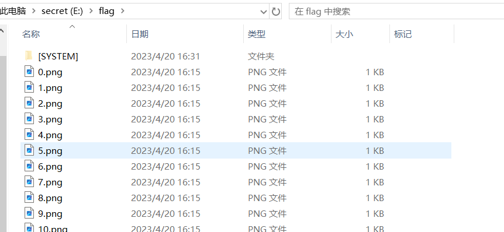

对于拼接图片可以使用`apt install imagemagick`在kali中安装`imagemagick`工具：

使用方法是`convert +append [图片1] [图片2] [...] [最后拼接的图片]`

但是我们有很多图片，所以用批处理，一下是一个批处理`shell`脚本；

```shell
#!/bin/bash

# 循环遍历0-14267的文件名，并逐个合并到book.txt中
#str = ""
for i in {0..685}; do
        file="${i}.png"
        str="${str}${file} "
done
echo $str
convert +append $str passwd.png

```

最后拼接的图片：

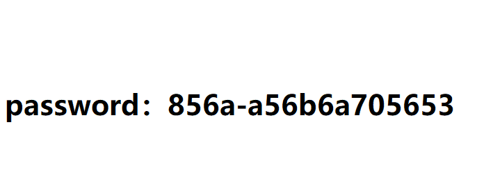

可以看到`password：856a-a56b6a705653`

同时我们也可以看一下其他图片拼接出来是什么：

```shell
#!/bin/bash

# 循环遍历0-14267的文件名，并逐个合并到book.txt中
str = ""
for i in {0..267}; do
        file="${i}.png"
        str="${str}${file} "
done
echo $str
convert -append $str tupian.png

```

拼接出来后：


拥有压缩包密码后，就开始提取`flag.zip`文件，我使用DiskGenius数据恢复软件进行提取：

打开软件，选取路径`E:\$RECYCLE.BIN\S-1-5-21-593056737-2904054994-1051541182-1001\`：

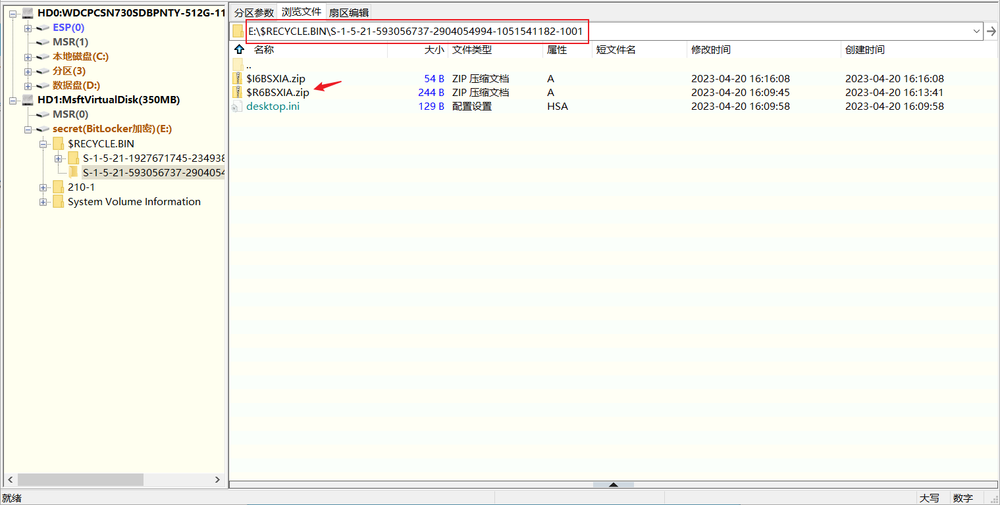

提取出后得到`flag.txt`看到`flag2:-919c-a140d7054ac5`

拼接得到`flag：f97d5b05-d312-46ac-919c-a140d7054ac5`

