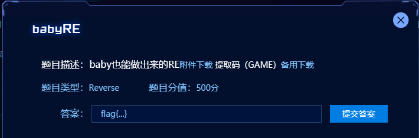
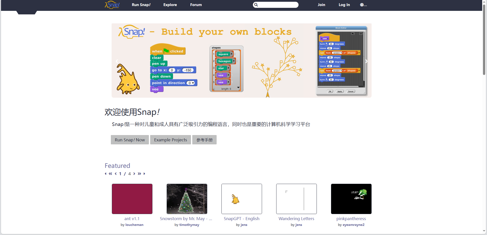
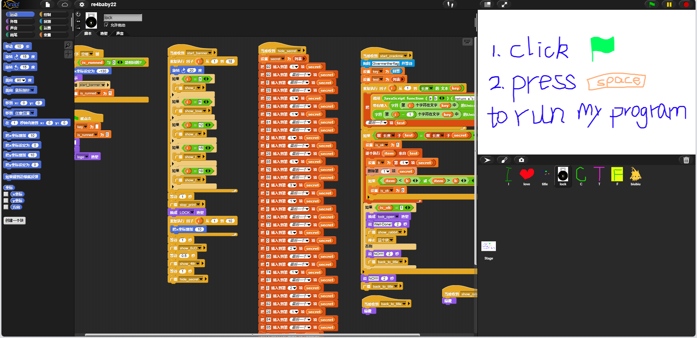

**题目描述**

​    

下载附件，一个xml文件，打开可以看待一系列代码，但是看不懂，搜索flag看到关键字-->flag{o_shit_i_dont_know_that}和一个test数组，在题目中尝试发现并不是正确答案，

换条思路

在文件开头发现一个网站，进入发现是一个儿童编程学习网站环境，进入



搜索得知snap是一个在线的编程环境，并且可以在github上找到，点击run进入在线环境（可调整语言为中文），打开题目文件



可以在lock中看到flag验证过程-->有两个变量key，test和一个数组secret，调用函数，参数分别为a，b；a = key[i]， b = key[i - 1]，将a和b进行异或操作，将得到的值写入test数组中，最后将得到的test数组与secret进行比对相等，则程序正常运行。根据程序的执行流程可以看出key就是我们输入的flag，根据此写出解题代码如下：

```c
#include <stdio.h>
#include <stdlib.h>
#include <string.h>

int main(){
    int test[] = { 102,10,13,6,28,74,3,1,3,7,85,0,4,75,20,92,92,8,28,25,81,83,7,28,76,88,9,0,29,73,0,86,4,87,87,82,84,85,4,85,87,30 };
    for(int i = 1; i < 43; i++){
        test[i] = test[i - 1] ^ test[i];
        printf("%c", test[i - 1]);
    }
    return 0;
}
// flag{12307bbf-9e91-4e61-a900-dd26a6d0ea4c}
```

