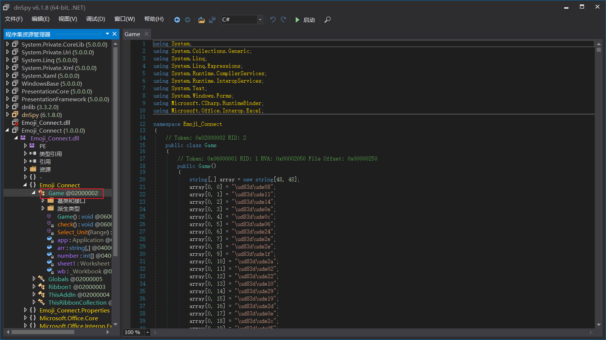
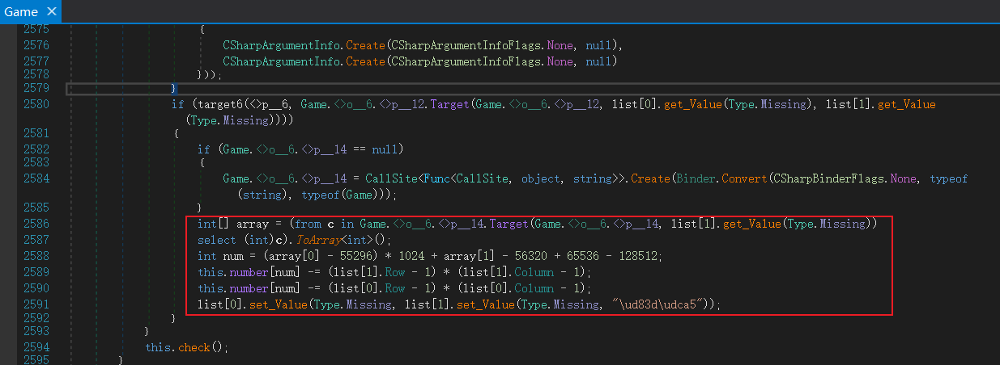

## 题目描述

连连看

## 解题

下载附件

可以看到四个程序，并且是`dll`后缀的程序，这是微软的`.NET`框架开发的程序，用`IDA`是不能进行逆向的，我们需要使用`.NET`程序集的逆向工具[dnsyp](https://github.com/dnSpy/dnSpy/releases "github")

用`dnsyp`打开`dll`文件：

找到主程序代码



可以看到我们是完全看不懂的。。。

简单查找一下关键信息--有一个非常大的`array`数组和一个`int`型的`number`数组

一下是通过询问`gpt`结果：

```markdown
1. 创建一个类的实例。
2. 获取当前运行的Excel应用程序，并将其设置为可见。
3. 获取当前活动的工作簿。
4. 如果之前未创建过，则创建一个用于将对象转换为Excel工作表的调用站点。
5. 将第一个工作表赋值给变量"sheet1"。
6. 创建一个Random实例。
7. 使用嵌套循环遍历一个48x48的二维数组。
8. 如果之前未创建过，则创建一个用于设置Excel单元格值的调用站点。
9. 将二维数组中的值设置到对应的单元格中。
基本上，这段代码在Excel中创建了一个48x48的表格，并将二维数组中的值填充到对应的单元格中。其他细节和上下文可能还需要更多信息才能完全理解代码的目的和功能。

1. 对工作表的区域"A1"到"Y50"进行水平居中对齐。
2. 绑定Excel工作表的"SelectionChange"事件，并将"Select_Unit"方法与之关联，以便在选择更改时触发该方法。

在"Select_Unit"方法中，具体含义如下：
1. 创建一个用于存储Excel单元格集合的列表。
2. 遍历目标单元格的集合，并将每个单元格作为Excel.Range对象添加到列表中。
3. 判断是否已经创建了一个用于判断条件是否为真的调用站点。
4. 检查目标单元格的计数是否等于2，将结果赋值给变量flag。
5. 声明一个obj2变量。

在上述代码中，根据变量 `flag` 的值进行条件判断。如果 `flag` 为真，则执行以下操作：
1. 检查之前是否已经创建了一个用于判断条件与的调用站点。
2. 获取列表中第一个单元格的值，并与 `null` 进行比较，使用调用站点的 `BinaryOperation` 方法进行比较操作。
3. 将比较的结果赋值给 `obj2`。
如果 `flag` 值为假，则将 `flag` 直接赋值给 `obj2`。
接下来，将 `obj2` 赋值给 `obj3`。
最后，根据条件判断创建一个用于判断条件是否为假的调用站点，并将结果赋值给 `obj4`。

在上述代码中，根据前面步骤得到的 `obj3` 的值进行判断。如果 `obj3` 不为假，则执行以下操作：
1. 检查之前是否已经创建了一个用于判断条件与的调用站点。
2. 获取列表中第二个单元格的值，并与 "\ud83d\udca5" 进行比较，使用调用站点的 `BinaryOperation` 方法进行比较操作。
3. 将比较的结果赋值给 `obj6`。

如果 `obj3` 值为假，则将 `obj3` 直接赋值给 `obj6`。

接下来，将 `obj6` 赋值给 `obj7`。

最后，根据条件判断创建一个用于判断条件是否为假的调用站点，并将结果赋值给 `obj7`。
接下来，根据条件判断创建一个用于判断条件与的调用站点，并将 `list[0].get_Value(Type.Missing)` 和 "\ud83d\udca5" 进行比较，使用调用站点的 `BinaryOperation` 方法进行比较操作。

如果为真，则执行以下操作：

1. 根据条件判断创建一个用于判断条件是否为真的调用站点，并将结果赋值给 `target6`。
2. 根据条件判断创建一个用于判断条件是否相等的调用站点。
3. 如果 `target6` 返回的结果为真，则执行以下操作：
   a. 创建一个整数数组，数组元素为 `Game.<>o__6.<>p__14.Target(Game.<>o__6.<>p__14, list[1].get_Value(Type.Missing))`，即将 `list[1].get_Value(Type.Missing)` 转换为整数数组。
   b. 计算出一个整数 `num`。
   c. 更新 `this.number[num]` 的值。
   d. 将 `list[0].get_Value(Type.Missing)` 和 `list[1].get_Value(Type.Missing)` 的值均设置为 "\ud83d\udca5"。

最后，调用 `this.check()` 方法。
方法中使用两层嵌套的循环遍历一个大小为 48x48 的二维数组。在每个循环中，执行以下操作：

1. 根据条件判断创建一个用于判断条件是否为真的调用站点，并将结果赋值给 `target`。
2. 根据条件判断创建一个用于判断值是否和 "\ud83d\udca5" 不相等的调用站点，并将结果赋值给 `target2`。
3. 获取 `this.sheet1.Cells[i + 1, j + 1]` 的值，并使用调用站点的 `GetMember` 方法获取该值的 `"Value"` 属性的值。
4. 将获取的值与 "\ud83d\udca5" 进行比较。
5. 如果比较结果为真，则返回，结束方法的执行。

如果两层循环执行完毕后仍未返回，则在最后弹出一个对话框，显示根据 `this.number` 数组中的值转换而成的 ASCII 字符串。

此外，还定义了一些私有字段和属性。`app`、`wb`、`sheet1` 分别表示 `Microsoft.Office.Interop.Excel.Application`、`Microsoft.Office.Interop.Excel._Workbook` 和 `Microsoft.Office.Interop.Excel.Worksheet` 对象。`arr` 表示一个字符串数组，`number` 表示一个整数数组。

```


通过对代码的分析找到程序的执行逻辑，找到主要代码（只有这里有关于数组的计算操作）：



怀疑最后得到的`this.number`是最终的`flag`：

```c#
if (target6(<>p__6, Game.<>o__6.<>p__12.Target(Game.<>o__6.<>p__12, list[0].get_Value(Type.Missing), list[1].get_Value(Type.Missing))))
				{
					if (Game.<>o__6.<>p__14 == null)
					{
						Game.<>o__6.<>p__14 = CallSite<Func<CallSite, object, string>>.Create(Binder.Convert(CSharpBinderFlags.None, typeof(string), typeof(Game)));
					}
					int[] array = (from c in Game.<>o__6.<>p__14.Target(Game.<>o__6.<>p__14, list[1].get_Value(Type.Missing))
					select (int)c).ToArray<int>();
					int num = (array[0] - 55296) * 1024 + array[1] - 56320 + 65536 - 128512;
					this.number[num] -= (list[1].Row - 1) * (list[1].Column - 1);
					this.number[num] -= (list[0].Row - 1) * (list[0].Column - 1);
					list[0].set_Value(Type.Missing, list[1].set_Value(Type.Missing, "\ud83d\udca5"));
				}
```

由代码解释不难看出，array就是上面的`48*48`数组，`number`也是，`list[0]`和`list[1]`的操作有点疑问，但是可以大胆猜测就是array数组，并且两个的值一样，所以`this.number[num] -= (list[1].Row - 1) * (list[1].Column - 1);`和`this.number[num] -= (list[0].Row - 1) * (list[0].Column - 1);`可以看成一句`this.number[num] -= [array元素的行标] * [array元素的列标]`。

所以写出解题`exp`：

首先进行数据整理

[整理后数据](./img/Emoji_Connect/data.txt)

```python
array = []
for i in range(48):
    array.append([0] * 48)

'''数组太大放不下'''

number = [
    25588, 31114, 28727, 26722, 24948, 25135, 25480, 29029, 23025, 25775, 15411, 25423, 25202, 30031, 27380, 30734,
    25054, 25109, 20741, 28568, 28802, 24591, 26063, 30940, 30375, 19411, 29573, 20845, 27232, 26743, 25779, 24986,
    31498, 30978, 22945, 26563, 35012, 29994, 27016, 29535, 21342, 26573, 27569, 25408, 31567, 25503, 21385, 27207]

for i in range(48):
    for j in range(48):
        x = int(array[i][j][:4], 16)
        y = int(array[i][j][4:], 16)
        num = (x - 55296) * 1024 + y - 56320 + 65536 - 128512
        number[num] -= i * j

print(b'flag{' + bytes(number)[6:-6] + b'}')

# b'flag{369d9412-f5c8-4aa4-8056-a7e4369d4555}'
```

得到`flag{369d9412-f5c8-4aa4-8056-a7e4369d4555}`

