**题目描述**

​    

通过题目可以猜测该题与tea加密算法有关。拖入exeinfope，64为的elf文件，在kali中运行程序查看特征

​    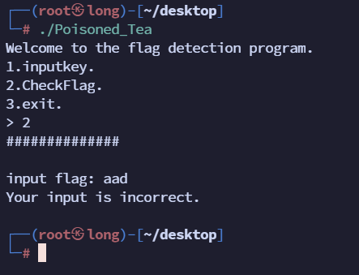

，用IDA打开可以发现在字符串页面中没有程序运行特征，并且发现无主程序main，并且识别不了一些函数，怀疑有壳但是用UPX工具不能脱，查看其中的函数，在函数sub_5847中发现疑似Tea加密算法特征， sub_5763函数疑似解密算法特征，

继续追踪函数5847，发现在sub_597A中用了5847这函数，

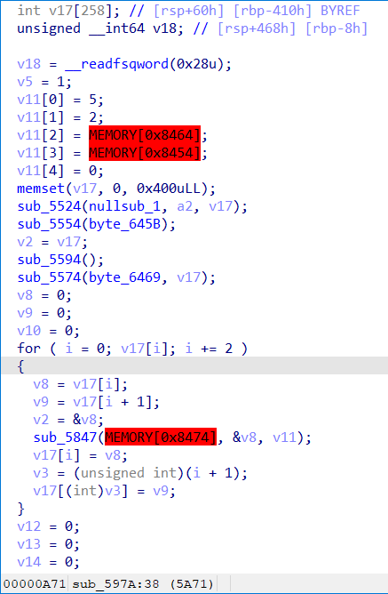

分析函数不难发现v11数组就是tea算法需要的key，v17就是解密的数据，但是v11和加密轮数这些重要数据都未识别到，那么可以采用动态调试的方式进行逆向，这里可以使用IDA自带的linux远程调试功能进行调试。

找到IDA的安装目录，进入dbgsrv目录下找到linux_server64位程序，将其放入kali中，并给其赋予执行权限，将题目也放入kali中赋予执行权限，

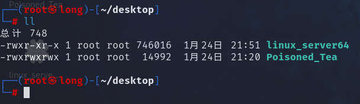

分别运行linux_server64和题目

```shell
./linux_server64 -P kali -p 12345    # -P定义密码；-p定义端口号 
./Poisoned_Tea
```

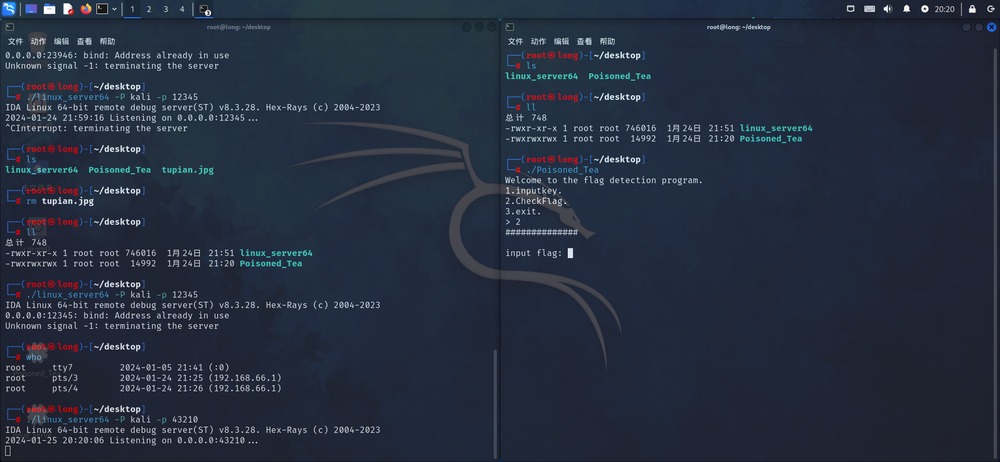

在IDA中找到debugger，选择远程linux调试，填写相关路径信息，

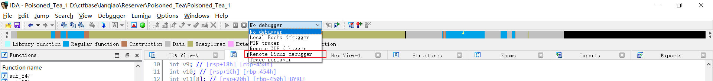

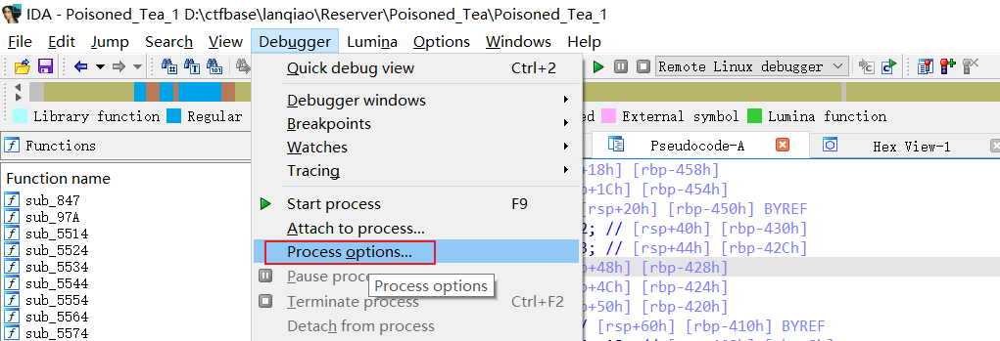

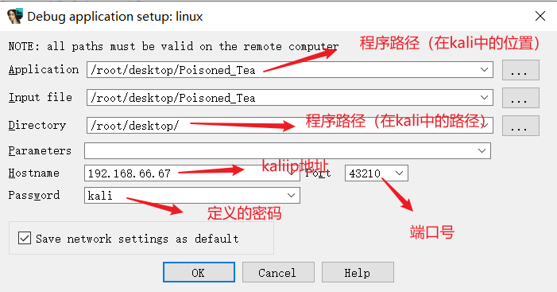

设置好后确定再在debugger选项卡中选择Attach to process选择要调试的附加程序.\Poisoned_Tea，开始调试


然后再kali运行的题目程序中选择选项二回车，


然后一直按F7单步步入，直到这个地方不能步入了（就是因为该函数不能被IDA识别），按P生成函数，然后再F5转换伪代码查看

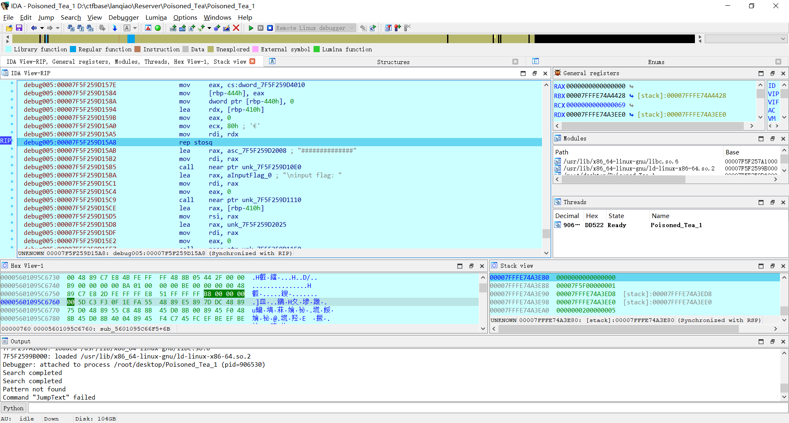

这就是该程序完整的执行流程了，

```c
__int64 __fastcall sub_7F2210AC8536(__int64 a1, __int64 a2)
{
  __int64 result; // rax
  int v3; // [rsp+8h] [rbp-468h]
  int i; // [rsp+Ch] [rbp-464h]
  int j; // [rsp+10h] [rbp-460h]
  int v6; // [rsp+14h] [rbp-45Ch] BYREF
  int v7; // [rsp+18h] [rbp-458h]
  int v8; // [rsp+1Ch] [rbp-454h]
  int v9[8]; // [rsp+20h] [rbp-450h] BYREF
  int v10; // [rsp+40h] [rbp-430h]
  int v11; // [rsp+44h] [rbp-42Ch]
  int v12; // [rsp+48h] [rbp-428h]
  int v13; // [rsp+4Ch] [rbp-424h]
  int v14; // [rsp+50h] [rbp-420h]
  int v15[258]; // [rsp+60h] [rbp-410h] BYREF
  unsigned __int64 v16; // [rsp+468h] [rbp-8h]

  v16 = __readfsqword(0x28u);
  v3 = 1;
  v9[0] = 5;
  v9[1] = 2;
  v9[2] = dword_7F2210ACB020;
  v9[3] = dword_7F2210ACB010;
  v9[4] = 0;
  memset(v15, 0, 0x400uLL);
  ((void (__fastcall *)(const char *, __int64, int *))unk_7F2210AC80E0)("##############", a2, v15);
  ((void (__fastcall *)(const char *))unk_7F2210AC8110)("\ninput flag: ");
  ((void (__fastcall *)(void *, int *))unk_7F2210AC8150)(&unk_7F2210AC9025, v15);
  ((void (*)(void))unk_7F2210AC8130)();
  v6 = 0;
  v7 = 0;
  v8 = 0;
  for ( i = 0; v15[i]; i += 2 )    //调用Tea加密程序对数据进行两字节两字节的加密
  {
    v6 = v15[i];
    v7 = v15[i + 1];
    ((void (__fastcall *)(_QWORD, int *, int *))unk_7F2210AC8403)((unsigned int)dword_7F2210ACB030, &v6, v9);    //Tea函数，有三个参数，第一个是算法执行迭代轮数，第二个参数是加密的数据，第三个是密钥key
    v15[i] = v6;
    v15[i + 1] = v7;
  }
  v10 = 0;
  v11 = 0;
  v12 = 0;
  v13 = 0;
  v14 = 0;
  for ( j = 0; v15[j]; j += 2 )    // 为验证程序，其中的dword_7F2210ACB1E0就是最后程序输出的数据，提取得到dword_7F2210ACB1E0[] = { 0xECFDA301, 0x61BECDF5, 0xB89E6C7D, 0xCE36DC68, 0x4B6E539E, 0x642EB504, 0x54F9D33C, 0x6D06E365, 0xEA873D53,0xA4618507, 0xD7B18E30, 0xC45B4042 }
  {
    v10 = dword_7F2210ACB1E0[j];
    v11 = dword_7F2210ACB1E0[j + 1];
    v12 = v15[j];
    v13 = v15[j + 1];
    if ( v10 != v12 || v11 != v13 )
    {
      v3 = 0;
      break;
    }
  }
  if ( v3 )
    ((void (__fastcall *)(const char *))unk_7F2210AC80E0)("Your input is correct.");
  else
    ((void (__fastcall *)(const char *))unk_7F2210AC80E0)("Your input is incorrect.");
  result = 0LL;
  if ( v16 != __readfsqword(0x28u) )
    return ((__int64 (*)(void))unk_7F2210AC8100)();
  return result;
}
```


在其中可以看到完整的key和Tea加密轮数，拿出来分别是key = [ 5, 2, 9, 7 ]， 轮数是0x24也就是36

点击unk_7F2210AC8403函数也就是我们开始看到的Tea加密函数，进入，再按P生成函数并转为伪代码得到：

```c
__int64 __fastcall sub_7F2210AC8403(int a1, unsigned int *a2, __int64 a3)
{
  __int64 result; // rax
  int i; // [rsp+24h] [rbp-14h]
  unsigned int v5; // [rsp+28h] [rbp-10h]
  unsigned int v6; // [rsp+2Ch] [rbp-Ch]
  unsigned int v7; // [rsp+30h] [rbp-8h]

  v5 = *a2;
  v6 = a2[1];
  v7 = 0;
  for ( i = 0; i < a1; ++i )
  {
    v5 += (v6 + ((v6 >> 5) ^ (16 * v6))) ^ (*(_DWORD *)(4LL * (v7 & 3) + a3) + v7);
    v7 -= 1091584273;
    v6 += (v5 + ((v5 >> 5) ^ (16 * v5))) ^ (*(_DWORD *)(4LL * ((v7 >> 11) & 3) + a3) + v7);
  }
  *a2 = v5;
  result = v6;
  a2[1] = v6;
  return result;
}
```


但是我们还发现一个问题，就是Tea算法在加密是使用的delte在加密时是一直累加而不是想该程序这样-->v7 -= 1091584273（v7 -= 0x41104111）；一直减，但是我们知道在二进制运算中在某些情况下两个互为补码的数可以互转，也就是

v7 -= 0x41104111可以写成v7 += 0xBEEFBEEF（按位取反）

> 以下结果来自GPT
>
> 在某些情况下，`v7 -= 0x41104111` 和 `v7 += 0xBEEFBEEF` 是等效的，这是因为 `-0x41104111` 和 `0xBEEFBEEF` 是互为补数。
>
> 补数是一种表示负数的方式，计算器或计算机系统用它来执行负数的算术运算。补数分为两个类型：二进制补码和十进制补码。在计算机系统中，常用的是二进制补码。
>
> 在二进制补码中，正数的二进制表示保持不变，而负数通过将其正数的二进制表示反转（按位取反），然后再加1。这种表示方法使得计算机可以用相同的硬件逻辑执行正数和负数的加法和减法运算。
>
> 补数的性质之一是，两个补数相加得到的结果是一个全1的二进制数。也就是说，`0x41104111 + 0xBEEFBEEF` 的结果是一个全1的二进制数。
>
> 因此，`v7 -= 0x41104111` 和 `v7 += 0xBEEFBEEF` 对于某些变量 `v7` 来说是等效的。这是因为通过在 `v7` 上执行两个操作，都会改变 `v7` 的值，使其变得不同，但是最终结果会变成一个全1的二进制数。
>
> 需要注意的是，这种等效只存在于特定的情况下，其中涉及到补数的数值表示。在一般情况下，减法操作和加法操作是不等效的。

根据此，写出该Tea算法的解密程序：

```c
#include<stdio.h>
#include<stdlib.h>
#include<stdint.h>

int main(){
    uint32_t key[] = { 5, 2, 9, 7 };
    
    uint32_t flag[] = { 0xECFDA301, 0x61BECDF5, 0xB89E6C7D, 0xCE36DC68, 0x4B6E539E, 0x642EB504, 0x54F9D33C, 0x6D06E365, 0xEA873D53,0xA4618507, 0xD7B18E30, 0xC45B4042 };
    uint32_t x = 0;
    uint32_t y = 0;
    uint32_t delta = 0xbeefbeef;    //0x41104111
    uint32_t sum = delta * 36;

    for(int i = 0; i < 12; i += 2){
        x = flag[i];
        y = flag[i + 1];
        sum = delta * 36;
        for(int j = 0; j < 36; j++){
            y -= (x + ((x >> 5) ^ (16 * x))) ^ (*(((sum >> 11) & 3) + key) + sum);
            sum -= delta;
            x -= (y + ((y >> 5) ^ (16 * y))) ^ (*((sum & 3) + key) + sum);
        }
        flag[i] = x;
        flag[i + 1] = y;
    }
    printf("%s", flag);
    return 0;
}
// Thisisflag{cdfec405-3f4b-457e-92fe-f6446098ee2e}
```


其中的flag数组是在静态调试时获取到的dword_7F2210ACB1E0，一共12个数据；

**注**

在本解法最后一步中得到的数据有些问题，在动态调试时发现dword_7F2210ACB1E0数组并不是12个，在文章开头时猜测过本题有壳但是用exeinfope查询不出就此作罢，但是在用另一个工具die时发现了UPX壳，用wenhex打开

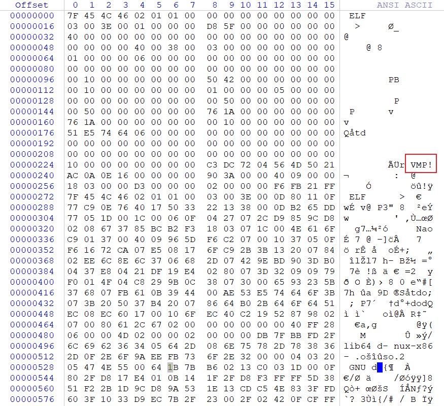

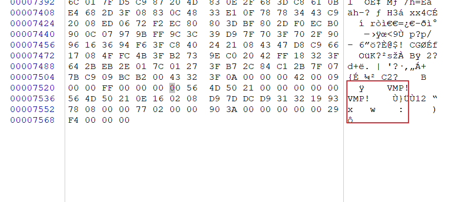

确实很符合修改过UPX壳特征的痕迹，将VMP全部替换成UPX（注意大写）后，发现确实可以用upx工具进行脱壳了，脱壳后脱如IDA中得到的代码很完整：

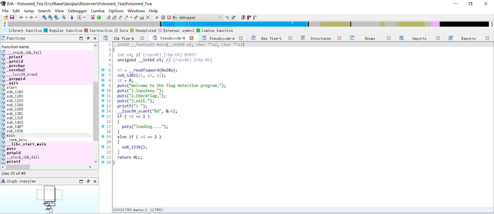

其中的验证数据也很完整，但是在与动态调试时获取到的数据不一样，应该是程序在运行过程中进行了修改（太狗了），所以就算是脱壳后也要进行远程动态调试；

还有一种解法是不用脱壳直接将程序拖入IDA中进行手动定义函数：

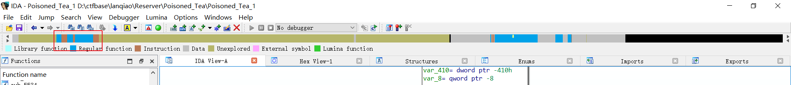

在IDA上方的内存分布中可以在函数区段发现4个红区，这就是IDA未成功识别函数的位置，直接鼠标移到此处，点击进入

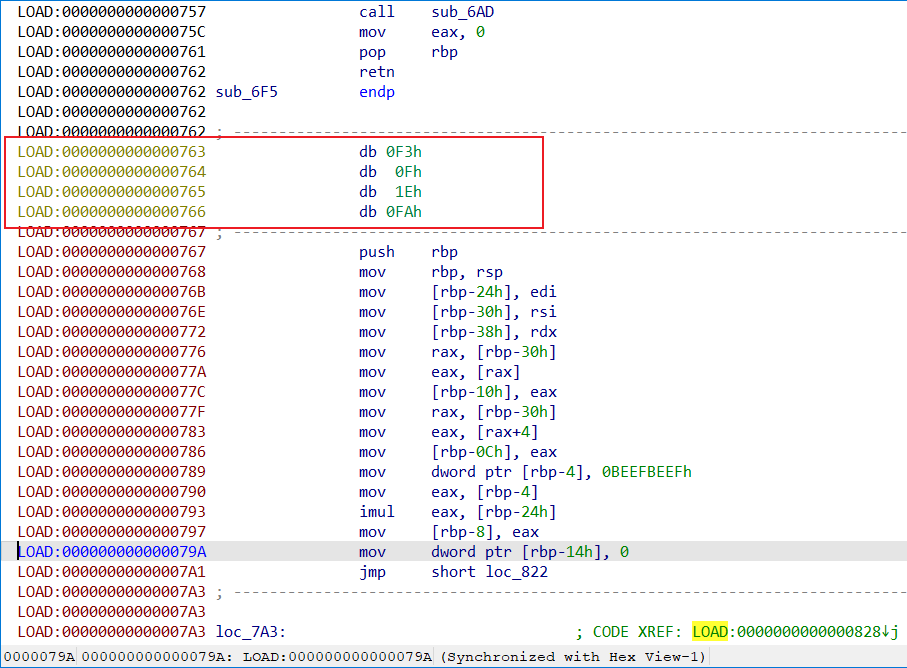

可以看到4个奇怪数据，将鼠标点击763位置按u键取消定义，在按p生成函数

变成这样

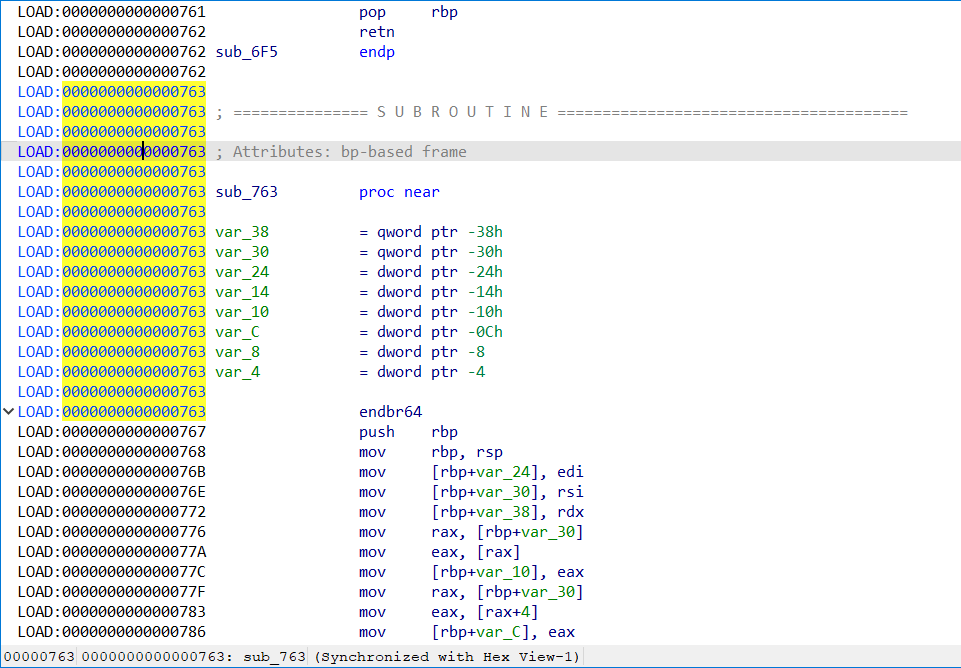

其他三个地方同理，修复完成后重新加载即可得到相对完整数据（**没成功**），当然程序运行时该改的值还是会改，所以三种方法不变的是都需要进行动态调试，不一样的地方只是开始拿到题目对题目进行的初步处理不一样。

还有就是发现IDA提取数据时只会单字节提取，但是这个题目要求丢长整型进行数据处理，需要注意