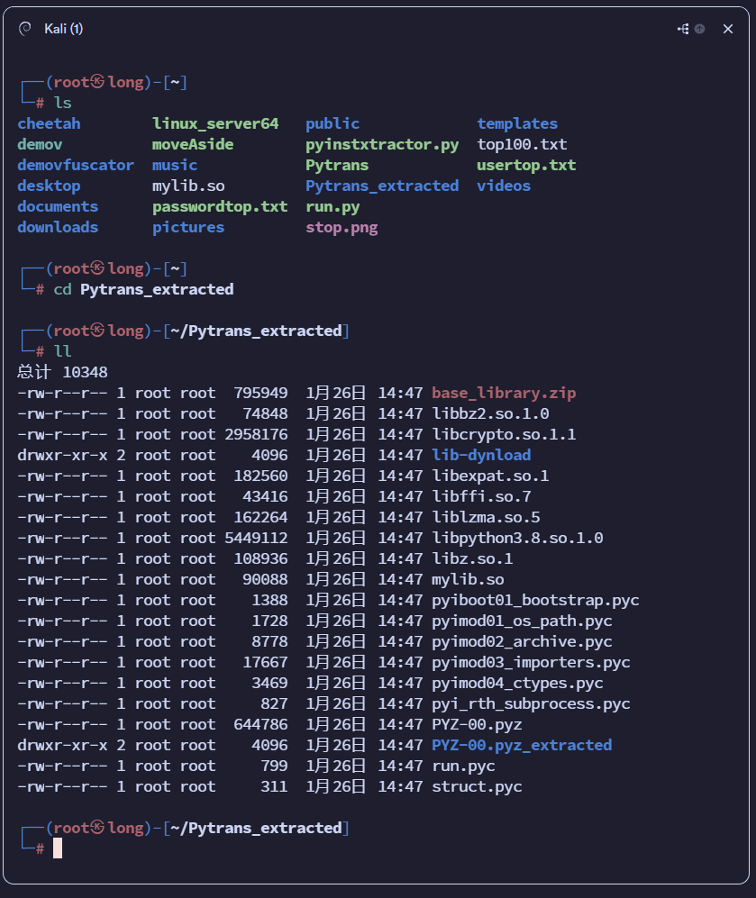
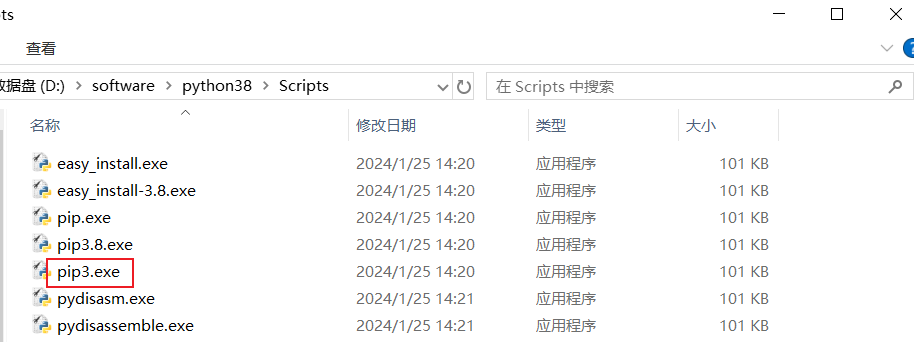
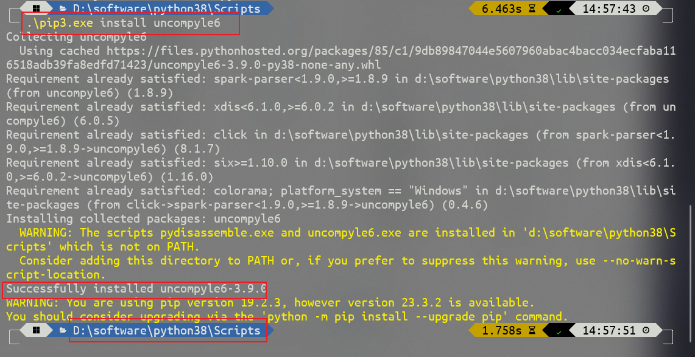
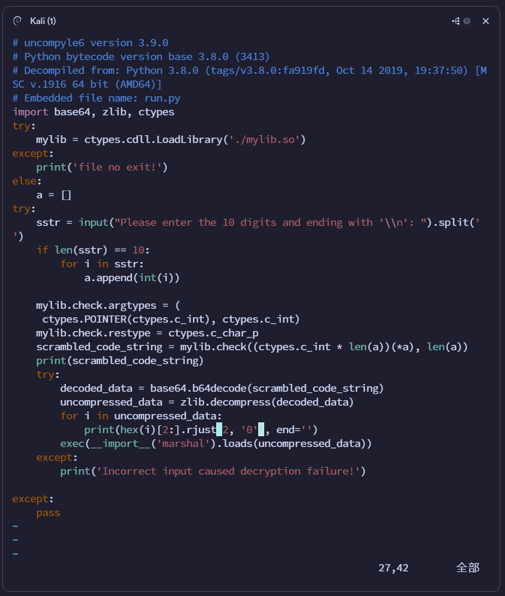
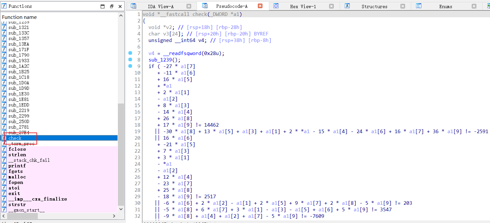
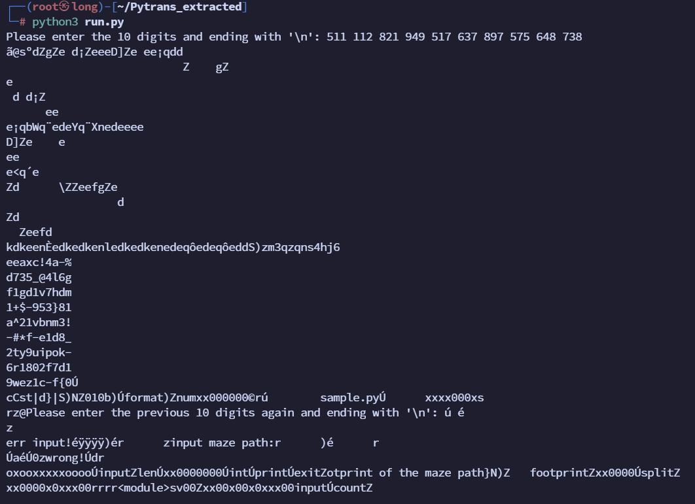
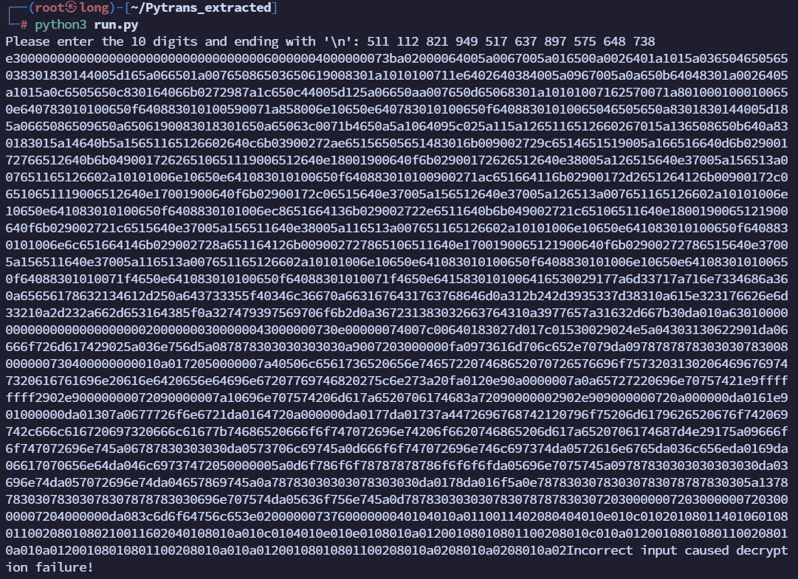
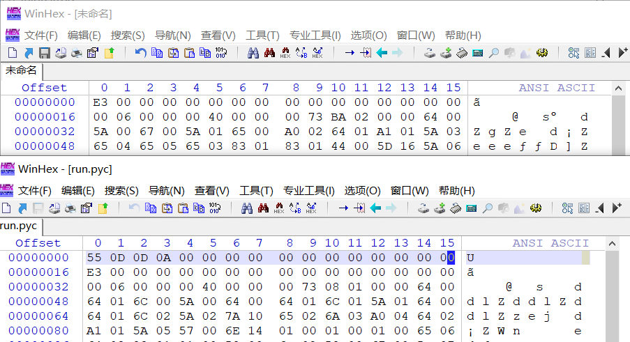
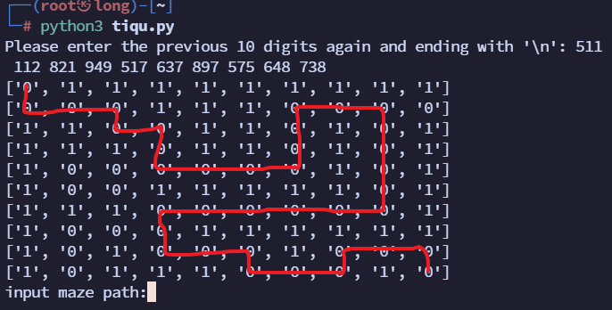
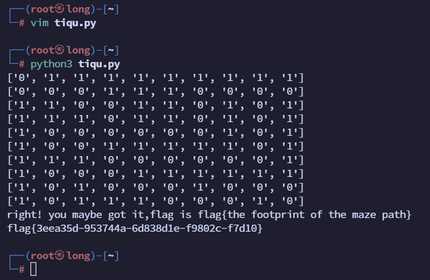

**题目描述**

​    

下载附件是一个elf文件，根据题目描述猜测应该是pythonpip打包的elf文件，用pyinstxtractor反编译工具来反编译出源文件：


查看提取到的文件



可以看到两个主程序run.pyc和struct.pyc，用uncompyle6将其进行反编译成py文件,注意uncompyle6的版本应当与文件使用的python版本一致，通过文件我们可以知道该题目用的是python3.8,由于linux安装多版本python比较复杂，所以uncompyle6命令我是在windows系统下使用，python3.8安装在windows下也很简单，只要在安装时不要选添加到环境变量即可，后续安装python3.8后使用该版本的pip只要找到python3.8的主目录下的Script下通过cmd命令再用pip命令即可：

```shell
.\uncompyle6.exe -o run.py[的文件路径] run.pyc[的文件路径] 
.\uncompyle6.exe -o struct.py[的文件路径] struct.pyc[的文件路径]
```



Warning警告不用管，这样uncompyle6库就安装成功，使用的话也是同理，在该目录下使用上面的命令就行




反编译好后再讲得到的文件拉回到kali，（pyinstxtractor.py该工具也可以在windows下使用），由于该题目是一个elf文件，所以就算是提取出来的也都是elf的linux文件，所以在kali（linux）环境中才能运行。

查看run.py源代码：



可以看到流程是先让我们输入10个数，以回车结尾，再调取mylib.so文件里的check函数，对我们输入的值进行操作，那下一步就是分析文件中的mylib.so文件，将其放入IDA中：



可以看到check函数的代码是将我们输入的10个值进行操作在当做if语句做判断条件a1数组就是我们输入的10个值，直接通过该函数的几个条件想要求解这10无疑是异常困难的，那么接下来我就有要是用一个CTF逆向中有一个非常重要的工具z3库，

> Z3 在工业应用中实际上常见于软件验证、程序分析等。然而由于功能实在强大，也被用于很多其他领域。CTF 领域中，能够用约束求解器搞定的问题常见于密码题、二进制逆向、符号执行、Fuzzing 模糊测试等。

详细用法就不展开讲，感兴趣自己去搜索，直接给出代码：注意IDA中的*a1就是值得a1数组起始地址，也就是a1[0]

```python
from z3 import *

a1 = [BitVec('a%d' % i, 16) for i in range(10)]
solver = Solver()

solver.add(-27 * a1[7]
           + -11 * a1[6]
           + 16 * a1[5]
           + a1[0]
           + 2 * a1[1]
           - a1[2]
           + 8 * a1[3]
           - 14 * a1[4]
           + 26 * a1[8]
           + 17 * a1[9] == 14462)
solver.add(-30 * a1[8] + 13 * a1[5] + a1[3] + a1[1] + 2 * a1[0] - 15 * a1[4] - 24 * a1[6] + 16 * a1[7] + 36 * a1[9] == -2591)
solver.add(16 * a1[6]
           + -21 * a1[5]
           + 7 * a1[3]
           + 3 * a1[1]
           - a1[0]
           - a1[2]
           + 12 * a1[4]
           - 23 * a1[7]
           + 25 * a1[8]
           - 18 * a1[9] == 2517)
solver.add(-6 * a1[6] + 2 * a1[2] - a1[1] + 2 * a1[5] + 9 * a1[7] + 2 * a1[8] - 5 * a1[9] == 203)
solver.add(-5 * a1[8] + 6 * a1[7] + 3 * a1[1] - a1[3] - a1[5] + a1[6] + 5 * a1[9] == 3547)
solver.add(-9 * a1[8] + a1[4] + a1[2] + a1[7] - 5 * a1[9] == -7609)
solver.add(2 * a1[5] + -a1[3] - a1[4] + a1[8] + 6 * a1[9] == 4884)
solver.add(a1[6] - a1[7] + 2 * a1[8] == 1618)
solver.add(a1[4] - a1[6] + 2 * a1[9] == 1096)
solver.add(a1[8] + a1[4] + a1[3] + a1[2] + a1[1] + a1[0] - a1[5] - a1[6] - a1[7] - a1[9] == 711)
solver.add(2 * (2 * a1[4] + a1[3]) + 5 * a1[5] == 7151)

if solver.check() == sat:
    num = solver.model()
    print(num)
'''
[a6 = 897,
 a7 = 575,
 a9 = 738,
 a5 = 637,
 a3 = 949,
 a0 = 511,
 a1 = 112,
 a2 = 821,
 a4 = 517,
 a8 = 648]
 '''
```


运行后得到10个数，按照循序排列，得到程序要求输入的10个数：a1 = 511 112 821 949 517 637 897 575 648 738，

将这10个数放入程序中运行，发现后面还要求输入：


返回查看源代码，可以看到还有后面部分将我们输入的10个值进行一系列操作后，进行base64编码，再进行zlib压缩得到uncompressed_data，我们不用管编码什么，直接编辑run.py输出最后的uncompressed_data数据，


可以看到用字符输出确实有些信息，



再次编辑run.py代码，让其以winhex格式一字节一字节的16进制输出，并以ASCII Hex形式粘贴到winhex中（后面的字符串不用复制，是程序本身输出）：




看过run.pyc文件的16进制就会发现，该文件与他非常相似，知识少了一个文件头，



我们补全后并把他命名为pyc文件，然后再用uncompyle6反编译得到一个py文件，查看源代码：

```python
# uncompyle6 version 3.9.0
# Python bytecode version base 3.8.0 (3413)
# Decompiled from: Python 3.8.0 (tags/v3.8.0:fa919fd, Oct 14 2019, 19:37:50) [MSC v.1916 64 bit (AMD64)]
# Embedded file name: sample.py
footprint = '3qzqns4hj6\neeaxc!4a-%\nd735_@4l6g\nf1gd1v7hdm\n1+$-953}81\na^21vbnm3!\n-#*f-e1d8_\n2ty9uipok-\n6r1802f7d1\n9wez1c-f{0'
xx0000 = []
footprintlist = footprint.split('\n')
for i in range(len(footprintlist)):        # 将footprint数组以‘\n’分割放入xx0000中
    xx0000.append(list(footprintlist[i]))
else:

    def xxxx000x0(num):        # 将输入的num转换成10位的二进制数
        xx000000 = format(num, '010b')
        return xx000000


    oxooxxxxxoooo = []
    xx0000000 = input("Please enter the previous 10 digits again and ending with '\\n': ").split(' ')        # 让我们再次输入10个数
    if len(xx0000000) == 10:        # 将输入的数的数量做比较，只要等于10就通过
        try:
            for i in xx0000000:
                oxooxxxxxoooo.append(int(i))

        except:
            print('err input!')
            exit(-1)

    else:
        print('err input!')
        exit(-1)
    for i in range(len(oxooxxxxxoooo)):        # 看到这里我们可以发现10个数并不是随便输入，应该也是run.py程序需要的那10个数
        oxooxxxxxoooo[i] = list(xxxx000x0(oxooxxxxxoooo[i]))    # 看到这里，结合上面函数的功能可以发现迷宫是一个10*10的阵列，并且就是我们输入的10个数生成的。放在oxooxxxxxoooo中
    else:
        xx0000x000 = oxooxxxxxoooo    # 将迷宫存储在xx0000x000中，定义起始位置坐标是（0，0）
        x, o = (0, 0)
        xx00x00x0xxx00 = [(x, o)]
        xx00x00x0xxx00input = list(input('input maze path:'))
        count = 0
        while (x, o) != (9, 9):                        # 用xx00x00x0xxx00数组存储用户每次按键后在迷宫中的位置坐标
            if count < len(xx00x00x0xxx00input):
                xx0000x0xxx00 = xx00x00x0xxx00input[count]
                if xx0000x0xxx00 == 'a':
                    if o > 0 and xx0000x000[x][o - 1] == '0':
                        o -= 1
                        count += 1
                        xx00x00x0xxx00.append((x, o))
                    else:
                        print('wrong!')
                        exit(-1)
                elif xx0000x0xxx00 == 'd':
                    if o < 9 and xx0000x000[x][o + 1] == '0':
                        count += 1
                        o += 1
                        xx00x00x0xxx00.append((x, o))
                    else:
                        print('wrong!')
                        exit(-1)
                else:
                    if xx0000x0xxx00 == 'w':
                        if x > 0 and xx0000x000[x - 1][o] == '0':
                            count += 1
                            x -= 1
                            xx00x00x0xxx00.append((x, o))
                        else:
                            print('wrong!')
                            exit(-1)
                    else:
                        if xx0000x0xxx00 == 's':
                            if x < 9 and xx0000x000[x + 1][o] == '0':
                                count += 1
                                x += 1
                                xx00x00x0xxx00.append((x, o))
                            else:
                                print('wrong!')
                                exit(-1)
                        else:
                            print('wrong!')
                            exit(-1)
            else:
                print('wrong!')
                exit(-1)

        print('right! you maybe got it,flag is flag{the footprint of the maze path}')
```


可以看到这是一个迷宫游戏，找到迷宫存储位置，直接编辑代码输出迷宫：

```python

    oxooxxxxxoooo = []
    xx0000000 = input("Please enter the previous 10 digits again and ending with '\\n': ").split(' ')
    if len(xx0000000) == 10:
        try:
            for i in xx0000000:
                oxooxxxxxoooo.append(int(i))

        except:
            print('err input!')
            exit(-1)

    else:
        print('err input!')
        exit(-1)
    for i in range(len(oxooxxxxxoooo)):
        oxooxxxxxoooo[i] = list(xxxx000x0(oxooxxxxxoooo[i]))
    else:
        xx0000x000 = oxooxxxxxoooo
        for i in oxooxxxxxoooo:    # 添加for循环输出迷宫
            print(i)
        x, o = (0, 0)
        xx00x00x0xxx00 = [(x, o)]
        xx00x00x0xxx00input = list(input('input maze path:'))
        count = 0

```


运行文件得到迷宫答案：sddsdssdddwwwddsssssaaaaassddsddwdds



运行文件输入迷宫答案：

得知flag就是迷宫路径答案经过的footprint字符串的字符


为了方便，直接编辑tiqu.py

```python
# uncompyle6 version 3.9.0
# Python bytecode version base 3.8.0 (3413)
# Decompiled from: Python 3.8.0 (tags/v3.8.0:fa919fd, Oct 14 2019, 19:37:50) [MSC v.1916 64 bit (AMD64)]
# Embedded file name: sample.py
footprint = '3qzqns4hj6\neeaxc!4a-%\nd735_@4l6g\nf1gd1v7hdm\n1+$-953}81\na^21vbnm3!\n-#*f-e1d8_\n2ty9uipok-\n6r1802f7d1\n9wez1c-f{0'
xx0000 = []
footprintlist = footprint.split('\n')
for i in range(len(footprintlist)):
    xx0000.append(list(footprintlist[i]))
else:

    def xxxx000x0(num):
        xx000000 = format(num, '010b')
        return xx000000


    oxooxxxxxoooo = []

# 这里    # xx0000000 = input("Please enter the previous 10 digits again and ending with '\\n': ").split(' ')

    xx0000000 = '511 112 821 949 517 637 897 575 648 738'.split(' ')
    if len(xx0000000) == 10:
        try:
            for i in xx0000000:
                oxooxxxxxoooo.append(int(i))

        except:
            print('err input!')
            exit(-1)

    else:
        print('err input!')
        exit(-1)
    for i in range(len(oxooxxxxxoooo)):
        oxooxxxxxoooo[i] = list(xxxx000x0(oxooxxxxxoooo[i]))
    else:
        xx0000x000 = oxooxxxxxoooo
        for i in oxooxxxxxoooo:
            print(i)
        x, o = (0, 0)
        xx00x00x0xxx00 = [(x, o)]
# 这里        # xx00x00x0xxx00input = list(input('input maze path:'))
        xx00x00x0xxx00input = list('sddsdssdddwwwddsssssaaaaassddsddwdds')
        count = 0
        while (x, o) != (9, 9):
            if count < len(xx00x00x0xxx00input):
                xx0000x0xxx00 = xx00x00x0xxx00input[count]
                if xx0000x0xxx00 == 'a':
                    if o > 0 and xx0000x000[x][o - 1] == '0':
                        o -= 1
                        count += 1
                        xx00x00x0xxx00.append((x, o))
                    else:
                        print('wrong!')
                        exit(-1)
                elif xx0000x0xxx00 == 'd':
                    if o < 9 and xx0000x000[x][o + 1] == '0':
                        count += 1
                        o += 1
                        xx00x00x0xxx00.append((x, o))
                    else:
                        print('wrong!')
                        exit(-1)
                else:
                    if xx0000x0xxx00 == 'w':
                        if x > 0 and xx0000x000[x - 1][o] == '0':
                            count += 1
                            x -= 1
                            xx00x00x0xxx00.append((x, o))
                        else:
                            print('wrong!')
                            exit(-1)
                    else:
                        if xx0000x0xxx00 == 's':
                            if x < 9 and xx0000x000[x + 1][o] == '0':
                                count += 1
                                x += 1
                                xx00x00x0xxx00.append((x, o))
                            else:
                                print('wrong!')
                                exit(-1)
                        else:
                            print('wrong!')
                            exit(-1)
            else:
                print('wrong!')
                exit(-1)

        print('right! you maybe got it,flag is flag{the footprint of the maze path}')
# 这里
        flag = ''
        for i in range(len(xx00x00x0xxx00)):
            flag += xx0000[xx00x00x0xxx00[i][0]][xx00x00x0xxx00[i][1]]
        print('flag{' + flag + '}')

```


运行得到flag：    

