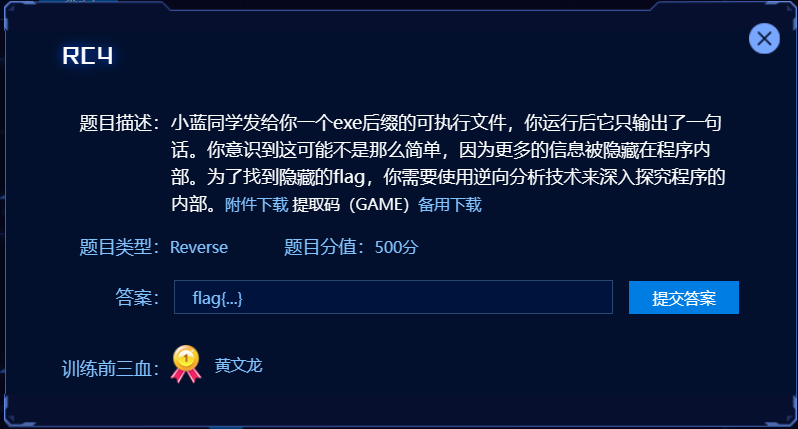
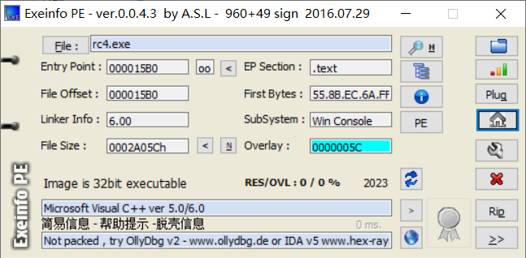
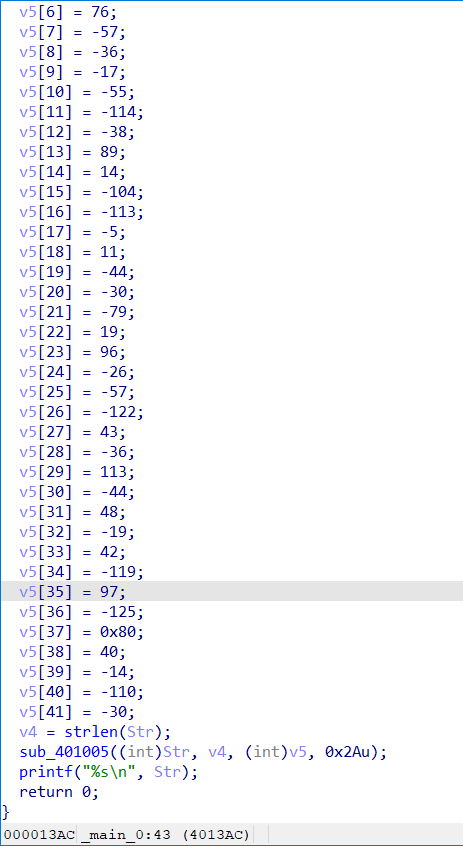
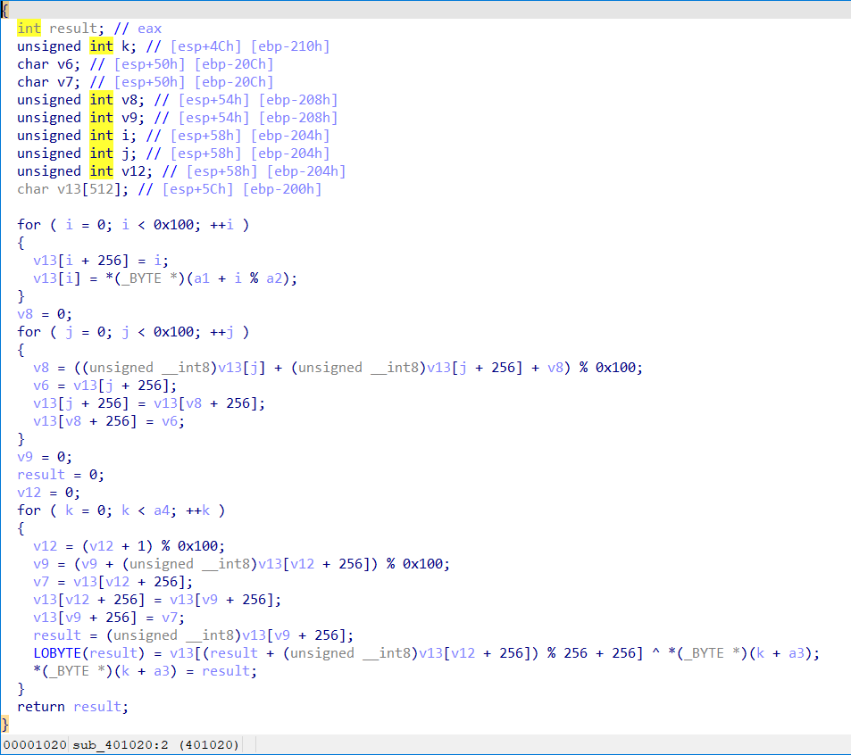

**Reverse--RC4**

**题目描述**

可以看到肯定与RC4加密有关

​    

老样子先扔到exeinfope中查看：无壳的32位程序



放入32位IDA中进行查看，找到main函数可以看到程序开始给了我们一个字符串str=“The quick brown fox jumps over a lazy dog.”和一个数组v5，结尾只有一个sub_401005函数，我们对该函数进行跟踪，看到最终执行的加密代码：

​    



可以看出非常典型的RC4加密代码（先进行初始化，再进行加密）可以学习学习RC4原理和代码实现，更据此可以写出最终结题exp：（数组v5即使待加密的数据，str即是密钥key）运行代码得到最终flag：flag{c8fd99f1-841a-44c9-8d38-746db6ff95c1}

```c
#include<stdio.h>
void rc4_init(unsigned char* s, unsigned char* key, unsigned long Len_k) //鍒濆鍖栧嚱鏁?
{
    int i = 0, j = 0;
    char k[256] = { 0 };
    unsigned char tmp = 0;
    for (i = 0; i < 256; i++) {
        s[i] = i;
        k[i] = key[i % Len_k];
    }
    for (i = 0; i < 256; i++) {
        j = (j + s[i] + k[i]) % 256;
        tmp = s[i];
        s[i] = s[j];
        s[j] = tmp;
    }
}
void rc4_crypt(unsigned char* Data, unsigned long Len_D, unsigned char* key, unsigned long Len_k) //鍔犺В瀵?
{
    unsigned char s[256];
    rc4_init(s, key, Len_k);
    int i = 0, j = 0, t = 0;
    unsigned long k = 0;
    unsigned char tmp;
    for (k = 0; k < Len_D; k++) {
        i = (i + 1) % 256;
        j = (j + s[i]) % 256;
        tmp = s[i];
        s[i] = s[j];
        s[j] = tmp;
        t = (s[i] + s[j]) % 256;
        Data[k] = Data[k] ^ s[t];
    }
}
int main()
{
    unsigned char key[] = "The quick brown fox jumps over a lazy dog.";
    unsigned long key_len = sizeof(key) - 1;
    unsigned char data[42] = {-120, 118, -41, 122, -76, 90, 76, -57, -36, -17, -55, -114, -38, 89, 14, -104, -113, -5, 11, -44, -30, -79, 19, 96, -26, -57, -122, 43, -36, 113, -44, 48, -19, 42, -119, 97, -125, 0x80, 40, -14, -110, -30};
    rc4_crypt(data, sizeof(data), key, key_len);
    for (int i = 0; i < sizeof(data); i++)
    {
        printf("%c", data[i]);
    }
    printf("\n");
}
```

