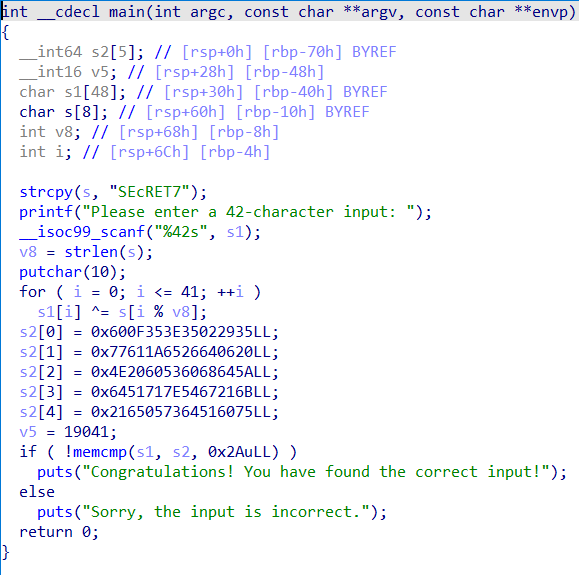

**题目描述**

​    

异或，无壳，用IDA打开，找到main函数，按F5转伪C代码

​    

可以看到是一个最简单的异或程序，根据代码，程序最终异或出来的就是s2数组，将s2数组复制出来，简单整理一下，得到一个c数组，写出解题代码：

```c
#include <stdio.h>
#include <stdlib.h>
#include <string.h>

int main(){
    char str[] = "SEcRET7";
    char s2[42] = 
    {
        0x60, 0x0F, 0x35, 0x3E, 0x35, 0x02, 0x29, 0x35, 
        0x77, 0x61, 0x1A, 0x65, 0x26, 0x64, 0x06, 0x20, 
        0x4E, 0x20, 0x60, 0x53, 0x60, 0x68, 0x64, 0x5A, 
        0x64, 0x51, 0x71, 0x7E, 0x54, 0x67, 0x21, 0x6B, 
        0x21, 0x65, 0x05, 0x73, 0x64, 0x51, 0x60, 0x75, 
        0x4A, 0x61
    };

    for(int i = 0; i < 42; i++){
        s2[i] ^= str[i % strlen(str)];
        printf("%c", s2[i]);
    }
    

    return 0;
}
// 3JVlpVf2H rSUe-r%W;!96%I"B9d12 !220V
```


很显然最终答案并不是我们想要的flag，继续分析。直接看汇编，发现s字符串再汇编代码中的存储并不是平常的样子（数组和字符串在寄存器中的存储方式为由低位到高位），而是将每个字符反过来放置在内存中，所以我们最终处理的s2数组应该也是要反过来的，最终得到正确代码：得到flag

```c
#include <stdio.h>
#include <stdlib.h>
#include <string.h>

int main(){
    char str[] = "SEcRET7";     // 37544552634553h(在IDA中识别到的)
    //int str[] = {0x53, 0x45, 0x63, 0x52, 0x45, 0x54, 0x37};   // 实际上的"SEcRET7"
    // 数组和字符串在寄存器中的存储方式为由低位到高位
    int s2[] = 
    { 
        0x35, 0x29, 0x02, 0x35, 0x3E, 0x35, 0x0F, 0x60,     // s2[0] = 0x600F353E35022935
        0x20, 0x06, 0x64, 0x26, 0x65, 0x1A, 0x61, 0x77,     // s2[1] = 0x77611A6526640620
        0x5A, 0x64, 0x68, 0x60, 0x53, 0x60, 0x20, 0x4E,     // s2[2] = 0x4E2060536068645A
        0x6B, 0x21, 0x67, 0x54, 0x7E, 0x71, 0x51, 0x64,     // s2[3] = 0x6451717E5467216B
        0x75, 0x60, 0x51, 0x64, 0x73, 0x05, 0x65, 0x21,     // s2[4] = 0x2165057364516075
        0x61, 0x4A                                          // s2[5] = 0x4A61
    };
    
    for(int i = 0; i < 42; i++){
        s2[i] ^= str[i % strlen(str)];
        printf("%c", s2[i]);
    }
    return 0;
}

// flag{a83ee6c1-2296-4d3e-9d3c-42604f76f7d5}
```

