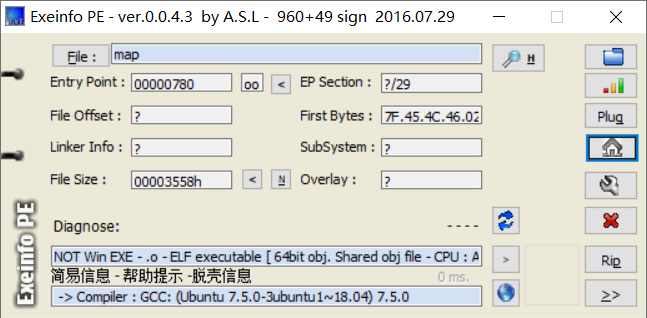
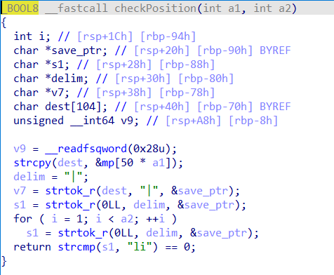
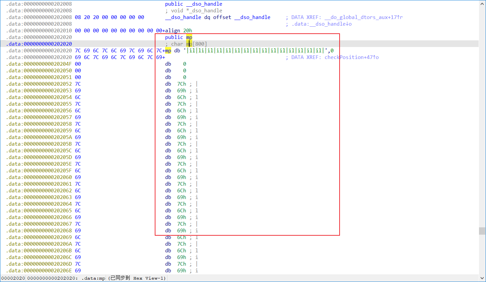

**题目描述**

根据题目描述可以知道该题与迷宫有关，所以之后分析可以着重找到迷宫地图

​    

扔入exeinfope中查看基本信息：C语言编写的elf64位linux程序



放入64位的IDA中查看，找到main函数，按F5反汇编


可以看出flag是我们输入的字符串的32位小端（小端就是小写，大端就是大写）md5值，再根据题目描述猜测我们输入的m字符串就是走出迷宫的最短路径！！！

分析程序，在switch语句中发现一个出现最多的函数checkPosition，双击进入



在其中发现一个mp数组双击进入发现就是我们需要的迷宫地图，



将mp数组全部选中，然后在编辑中找到导出数据可以更具需要快速导出数据，可以根据导出的数据用C语言（其他语言也可）编写脚本快速打印地图，此处还需注意由于mp数组第一行并未用16进制表示所以导出数据时并不会将其导出之后需自行加上脚本如下：

```c
#include <stdio.h>
#include <stdlib.h>
#include <string.h>

int main(){
    int map [] = {0x7C, 0x69, 0x6C, 0x7C, 0x6C, 0x69, 0x7C, 
  0x6C, 0x69, 0x7C, 0x6C, 0x69, 0x7C, 0x6C, 0x69, 0x7C, 0x6C, 
  0x69, 0x7C, 0x6C, 0x69, 0x7C, 0x69, 0x6C, 0x7C, 0x6C, 0x69, 
  0x7C, 0x69, 0x6C, 0x7C, 0x6C, 0x69, 0x7C, 0x69, 0x6C, 0x7C, 
  0x6C, 0x69, 0x7C, 0x69, 0x6C, 0x7C, 0x69, 0x6C, 0x7C, 0x00, 
  0x00, 0x00, 0x00, 0x7C, 0x69, 0x6C, 0x7C, 0x69, 0x6C, 0x7C, 
  0x69, 0x6C, 0x7C, 0x69, 0x6C, 0x7C, 0x69, 0x6C, 0x7C, 0x6C, 
  0x69, 0x7C, 0x69, 0x6C, 0x7C, 0x69, 0x6C, 0x7C, 0x69, 0x6C, 
  0x7C, 0x69, 0x6C, 0x7C, 0x6C, 0x69, 0x7C, 0x69, 0x6C, 0x7C, 
  0x69, 0x6C, 0x7C, 0x6C, 0x69, 0x7C, 0x69, 0x6C, 0x7C, 0x00, 
  0x00, 0x00, 0x00, 0x7C, 0x69, 0x6C, 0x7C, 0x69, 0x6C, 0x7C, 
  0x6C, 0x69, 0x7C, 0x6C, 0x69, 0x7C, 0x69, 0x6C, 0x7C, 0x6C, 
  0x69, 0x7C, 0x6C, 0x69, 0x7C, 0x6C, 0x69, 0x7C, 0x6C, 0x69, 
  0x7C, 0x6C, 0x69, 0x7C, 0x6C, 0x69, 0x7C, 0x6C, 0x69, 0x7C, 
  0x6C, 0x69, 0x7C, 0x69, 0x6C, 0x7C, 0x69, 0x6C, 0x7C, 0x00, 
  0x00, 0x00, 0x00, 0x7C, 0x69, 0x6C, 0x7C, 0x69, 0x6C, 0x7C, 
  0x69, 0x6C, 0x7C, 0x69, 0x6C, 0x7C, 0x69, 0x6C, 0x7C, 0x6C, 
  0x69, 0x7C, 0x69, 0x6C, 0x7C, 0x69, 0x6C, 0x7C, 0x6C, 0x69, 
  0x7C, 0x69, 0x6C, 0x7C, 0x69, 0x6C, 0x7C, 0x69, 0x6C, 0x7C, 
  0x69, 0x6C, 0x7C, 0x6C, 0x69, 0x7C, 0x69, 0x6C, 0x7C, 0x00, 
  0x00, 0x00, 0x00, 0x7C, 0x69, 0x6C, 0x7C, 0x6C, 0x69, 0x7C, 
  0x6C, 0x69, 0x7C, 0x69, 0x6C, 0x7C, 0x69, 0x6C, 0x7C, 0x6C, 
  0x69, 0x7C, 0x69, 0x6C, 0x7C, 0x69, 0x6C, 0x7C, 0x6C, 0x69, 
  0x7C, 0x6C, 0x69, 0x7C, 0x6C, 0x69, 0x7C, 0x69, 0x6C, 0x7C, 
  0x6C, 0x69, 0x7C, 0x69, 0x6C, 0x7C, 0x69, 0x6C, 0x7C, 0x00, 
  0x00, 0x00, 0x00, 0x7C, 0x69, 0x6C, 0x7C, 0x69, 0x6C, 0x7C, 
  0x6C, 0x69, 0x7C, 0x6C, 0x69, 0x7C, 0x6C, 0x69, 0x7C, 0x6C, 
  0x69, 0x7C, 0x69, 0x6C, 0x7C, 0x69, 0x6C, 0x7C, 0x6C, 0x69, 
  0x7C, 0x69, 0x6C, 0x7C, 0x6C, 0x69, 0x7C, 0x69, 0x6C, 0x7C, 
  0x69, 0x6C, 0x7C, 0x6C, 0x69, 0x7C, 0x69, 0x6C, 0x7C, 0x00, 
  0x00, 0x00, 0x00, 0x7C, 0x69, 0x6C, 0x7C, 0x69, 0x6C, 0x7C, 
  0x6C, 0x69, 0x7C, 0x69, 0x6C, 0x7C, 0x69, 0x6C, 0x7C, 0x69, 
  0x6C, 0x7C, 0x6C, 0x69, 0x7C, 0x69, 0x6C, 0x7C, 0x69, 0x6C, 
  0x7C, 0x6C, 0x69, 0x7C, 0x6C, 0x69, 0x7C, 0x6C, 0x69, 0x7C, 
  0x6C, 0x69, 0x7C, 0x69, 0x6C, 0x7C, 0x69, 0x6C, 0x7C, 0x00, 
  0x00, 0x00, 0x00, 0x7C, 0x69, 0x6C, 0x7C, 0x69, 0x6C, 0x7C, 
  0x69, 0x6C, 0x7C, 0x69, 0x6C, 0x7C, 0x69, 0x6C, 0x7C, 0x69, 
  0x6C, 0x7C, 0x69, 0x6C, 0x7C, 0x69, 0x6C, 0x7C, 0x69, 0x6C, 
  0x7C, 0x69, 0x6C, 0x7C, 0x69, 0x6C, 0x7C, 0x6C, 0x69, 0x7C, 
  0x69, 0x6C, 0x7C, 0x69, 0x6C, 0x7C, 0x69, 0x6C, 0x7C};

  for (int i = 0; i < 396; i++){
    if (map[i] == 0){
        printf("\n");
        i += 3;        //为了输出正确n行n列的迷宫地图
    }
    printf("%c", map[i]);
  }
    return 0;
}
/*
输出结果：
|il|li|li|li|li|li|li|il|li|il|li|il|li|il|il|
|il|il|il|il|il|li|il|il|il|il|li|il|il|li|il|
|il|il|li|li|il|li|li|li|li|li|li|li|li|il|il|
|il|il|il|il|il|li|il|il|li|il|il|il|il|li|il|
|il|li|li|il|il|li|il|il|li|li|li|il|li|il|il|
|il|il|li|li|li|li|il|il|li|il|li|il|il|li|il|
|il|il|li|il|il|il|li|il|il|li|li|li|li|il|il|
|il|il|il|il|il|il|il|il|il|il|il|li|il|il|il|
*/
```


在加上第一行迷宫组成完整迷宫，在放在文本编辑器（Sublime Text或其它）中进行处理便于观察迷宫，可以看到“il”代表的是墙，“li”代表的是路，所以得到正确走出迷宫的路径（起点可以自行判断）：sddddssdddssddssds，放入md5在线生成网站

由此写出flag：flag{6cc4fc7f5f2127cae570b4337c3db20f}

​    